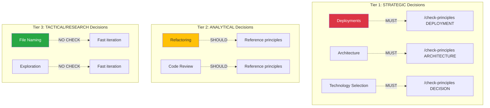

# Diff Explanation: Thinking Process Architecture Updates

**Document**: `.claude/diagrams/thinking-process-architecture-UPDATED.md`
**Type**: Proposed Changes (not yet applied)
**Generated**: 2026-01-04
**Lines**: 536 lines of proposed changes

---

## Summary

**Overall Intent**: Add 3-tier decision classification and principle-first workflow to thinking process architecture diagram

**Change Type**: Enhancement (extends existing architecture, doesn't replace)

**Risk Level**: Low
- Non-breaking (adds new sections, updates existing diagrams)
- Well-documented (detailed explanations for each tier)
- Backward compatible (existing workflow still valid, just enhanced)

---

## What's in the UPDATED File

### Structure

The file is NOT a diff/patch - it's a **proposal document** that shows:
1. **Summary of Changes** - High-level overview
2. **New Section to Add** - Section 5.1 (Decision Tiers)
3. **Updated Section 5** - Full Thinking Cycle with principle checking
4. **Updated Section 10** - Cognitive Assistance Model with CLASSIFY/CHECK_PRINCIPLES nodes
5. **Additional Changes** - Summary section update

### NOT a Traditional Diff

**This is a design document**, not a git diff. It shows:
- What sections to add (Section 5.1)
- What sections to replace (Section 5, Section 10)
- What the new content should be

**To see actual changes**, would need to:
```bash
# Apply changes to original file
# Then run:
git diff .claude/diagrams/thinking-process-architecture.md
```

---

## Proposed Changes Breakdown

### Change 1: Add Section 5.1 - Decision Tiers and Principle Checking

**What's being added**:
- **New section** (doesn't exist in current diagram)
- **Location**: After Section 5
- **Length**: ~200 lines

**Content**:

#### 1. Three Decision Tiers Diagram



**Visual encoding**:
- Red: STRATEGIC (high impact, MUST check)
- Yellow: ANALYTICAL (medium impact, SHOULD reference)
- Green: TACTICAL (low impact, NO check)

#### 2. Tier Descriptions

**Tier 1: STRATEGIC**:
- Characteristics: High impact, long-term, multi-stakeholder
- Examples: Deployments, architecture, technology selection
- Commands: `/deploy`, `/architect`, `/problem-statement`
- Workflow: MUST run `/check-principles` before proceeding
- Blocking: CRITICAL violations prevent decision

**Tier 2: ANALYTICAL**:
- Characteristics: Medium impact, reversible, developer-facing
- Examples: Refactoring, code review, test strategy
- Commands: `/what-if`, `code-review` skill, `/restructure`
- Workflow: SHOULD reference principles in analysis
- Non-blocking: Principle violations noted but don't prevent decision

**Tier 3: TACTICAL/RESEARCH**:
- Characteristics: Low impact, highly reversible, exploratory
- Examples: File naming, variable naming, exploration, debugging
- Commands: `/explore`, `/research` skill, `/trace`, `/hypothesis`
- Workflow: NO principle check (fast iteration)
- Rationale: Code review catches violations later

#### 3. Decision Tier Classification Heuristic

Table showing how to classify decisions:

| Criterion | Strategic | Analytical | Tactical |
|-----------|-----------|------------|----------|
| Impact | System-wide | Module-level | Local |
| Reversibility | Expensive | Moderate | Cheap |
| Scope | Multi-component | Single component | File/function |

**Examples**:
- "Deploy Lambda timeout increase" → STRATEGIC
- "Refactor this function" → ANALYTICAL
- "Name this variable" → TACTICAL

#### 4. Integration with Existing Workflow

Shows how principle checking fits into existing workflow:

**Before**:
```
Problem → Decompose → Explore → Specify → Validate → Implement
```

**After**:
```
Problem
    → Classify Decision Tier
    → [STRATEGIC] /check-principles
    → [ANALYTICAL] Reference principles
    → [TACTICAL] Skip check
    → Decompose → Explore → Specify → Validate → Implement
```

**Why this addition matters**:
- Makes decision tier classification explicit (not implicit)
- Shows where principle checking fits in workflow
- Provides heuristic for classification (reduces ambiguity)

---

### Change 2: Replace Section 5 - Full Thinking Cycle (Decision Making)

**What's being replaced**:
- **Current Section 5**: Shows workflow without principle checking
- **Length**: ~70 lines (Mermaid flowchart + description)

**New Section 5**: Shows workflow WITH principle checking
- **Length**: ~100 lines (expanded flowchart + description)

**New Nodes Added**:

1. **CLASSIFY** (Decision point):
   ```
   START → CLASSIFY{Classify Decision Tier}
       ↓
   CLASSIFY --[STRATEGIC]--> CHECK_PRINCIPLES
   CLASSIFY --[ANALYTICAL]--> UNDERSTAND
   CLASSIFY --[TACTICAL]--> UNDERSTAND
   ```

2. **CHECK_PRINCIPLES** (Strategic gate):
   ```
   CHECK_PRINCIPLES["/check-principles {scope}"]
       ↓
   VIOLATIONS{CRITICAL violations?}
   ```

3. **VIOLATIONS** (Decision point):
   ```
   VIOLATIONS --[Yes]--> BLOCK
   VIOLATIONS --[No]--> UNDERSTAND
   ```

4. **BLOCK** (Error state):
   ```
   BLOCK[BLOCK Decision - Show required fixes]
       ↓
   FIX_VIOLATIONS[Fix Violations]
       ↓
   CHECK_PRINCIPLES (loop back)
   ```

5. **REF_PRINCIPLES** (Note on analytical path):
   ```
   CMD_WHATIF -.->|ANALYTICAL tier| REF_PRINCIPLES[Include principle alignment]
   ```

**Color coding**:
- Red: CHECK_PRINCIPLES, BLOCK (strategic gate, error)
- Yellow: FIX_VIOLATIONS, REF_PRINCIPLES (warnings, references)
- Blue: CLASSIFY (decision point)

**Flow changes**:

**Before** (current):
```
START → UNDERSTAND → DECOMPOSE → EXPLORE → ...
```

**After** (proposed):
```
START → CLASSIFY → [STRATEGIC] CHECK_PRINCIPLES → VIOLATIONS → [If clear] UNDERSTAND → ...
                 → [ANALYTICAL] UNDERSTAND → ...
                 → [TACTICAL] UNDERSTAND → ...
```

**Why this replacement matters**:
- Shows principle checking as integral part of workflow (not optional)
- Makes blocking explicit (CRITICAL violations prevent progression)
- Different treatment for different decision tiers (not one-size-fits-all)

---

### Change 3: Replace Section 10 - Cognitive Assistance Model

**What's being replaced**:
- **Current Section 10**: Mindmap showing cognitive phases
- **Nodes**: UNDERSTAND, EXPLORE, DECIDE, DESIGN, IMPLEMENT, DEPLOY, LEARN

**New Section 10**: Same mindmap + 2 new nodes
- **New nodes**: CLASSIFY, CHECK_PRINCIPLES

**New Node 1: CLASSIFY**:
```
CLASSIFY[Classify Decision Tier]
    STRATEGIC (High impact)
    ANALYTICAL (Medium impact)
    TACTICAL (Low impact)
```

**New Node 2: CHECK_PRINCIPLES**:
```
CHECK_PRINCIPLES[Check Principles]
    "/check-principles command"
    DEPLOYMENT scope
    ARCHITECTURE scope
    DECISION scope
    BLOCK on CRITICAL violations
```

**Integration in mindmap**:
```
UNDERSTAND → CLASSIFY → [If STRATEGIC] CHECK_PRINCIPLES → EXPLORE → DECIDE → ...
```

**Why this replacement matters**:
- Mindmap shows principle checking as cognitive phase (like UNDERSTAND, EXPLORE)
- Visual representation of when principle checking happens
- Shows relationship between classification and checking

---

### Change 4: Update Summary Section

**What's being replaced**:
- **Current "The Full Cycle"**: Shows workflow without principle checking

**New "The Full Cycle"**:
```
User Problem
    ↓
Classify Decision Tier (STRATEGIC/ANALYTICAL/TACTICAL)
    ↓
[If STRATEGIC] Check Principles (MUST gate)
[If ANALYTICAL] Reference Principles (SHOULD include)
[If TACTICAL] Skip Principles (NO check)
    ↓
Commands orchestrate workflow
    ↓
Skills guide methodology
    ↓
System Prompt constrains decisions
    ↓
Tools execute actions
    ↓
Outputs generated
    ↓
Feedback updates knowledge base
```

**Why this update matters**:
- Summary reflects complete workflow including principle checking
- Shows tier-based treatment (MUST/SHOULD/NO)
- One-page view of entire process

---

## Impact Analysis

### Affected Sections

**Sections ADDED**:
- Section 5.1: Decision Tiers and Principle Checking (~200 lines)

**Sections REPLACED**:
- Section 5: Full Thinking Cycle (~70 → ~100 lines, +30)
- Section 10: Cognitive Assistance Model (mindmap nodes +2)
- Summary: The Full Cycle (~10 → ~15 lines, +5)

**Sections UNCHANGED**:
- Section 1-4: Architecture, Skills, Tools (no changes)
- Section 6-9: Skill Types, Composition, Information Flow, Layers (no changes)
- Section 11: Feedback Loops (no changes)

**Total line change**: ~235 lines added

---

### Affected Commands

**Commands that should be updated to match new architecture**:

1. **`/deploy`** - Already enforces `/check-principles` ✅
   - Action: Document existing enforcement as best practice
   - Link to Section 5.1 (STRATEGIC tier)

2. **`/architect`** - Should enforce `/check-principles` ❌
   - Action: Add Phase 0 (Principle Compliance Check)
   - Update frontmatter to include `/check-principles architecture`
   - Link to Section 5.1 (STRATEGIC tier)

3. **`/problem-statement`** - Should include principle matrix ❌
   - Action: Add Principle Compliance Matrix to Phase 5
   - Link to Section 5.1 (decision framework with principles)

4. **`/check-principles`** - Should add new scopes ❌
   - Action: Add ARCHITECTURE and DECISION scopes
   - Link to Section 5.1 (tier-to-scope mapping)

---

### Breaking Changes

**None** - This is purely additive:
- Existing workflow still valid (no removal)
- New sections extend understanding (don't replace)
- Commands can adopt gradually (phased rollout)

---

### Documentation Changes

**Must update**:
- [x] `.claude/diagrams/thinking-process-architecture.md` - Apply proposed changes
- [ ] `/deploy` command - Link to Section 5.1
- [ ] `/architect` command - Add Phase 0, link to Section 5.1
- [ ] `/problem-statement` command - Add principle matrix, link to Section 5.1
- [ ] `/check-principles` command - Add new scopes, link to Section 5.1

**Should update**:
- [ ] `.claude/evolution/2026-01-04-principle-first-decision-workflow.md` - Link to updated architecture
- [ ] `.claude/CLAUDE.md` - Reference architecture diagram for decision workflow

---

## Principles Adherence

### Principles Applied in These Changes

**✅ Principle #2 (Progressive Evidence Strengthening)**:
- Classification (Layer 1: Surface) → Principle check (Layer 2: Content) → Decision (Layer 3: Ground truth)
- Multi-layer approach to decision validation

**✅ Principle #9 (Feedback Loop Awareness)**:
- BLOCK → FIX_VIOLATIONS → CHECK_PRINCIPLES (retrying loop for principle violations)
- Meta-loop: If violations persist, escalate to questioning decision tier classification

**✅ Clarity and Documentation**:
- Visual representation (diagrams) + detailed explanations (text)
- Color coding for quick comprehension
- Heuristic table for classification

---

### Potential Issues

**⚠️ Complexity**:
- Issue: Diagram becomes more complex with CLASSIFY, CHECK_PRINCIPLES, BLOCK nodes
- Mitigation: Color coding simplifies (red = stop, yellow = caution, green = go)
- Mitigation: Section 5.1 provides detailed explanation

**⚠️ Onboarding burden**:
- Issue: New users must learn decision tier classification
- Mitigation: Heuristic table makes classification mechanical (not subjective)
- Mitigation: Examples show concrete classifications

---

## Review Checklist

**Before applying these changes, verify**:

### Content
- [ ] Section 5.1 content is complete (tiers, heuristic, integration)
- [ ] Section 5 flowchart includes all new nodes (CLASSIFY, CHECK_PRINCIPLES, VIOLATIONS, BLOCK)
- [ ] Section 10 mindmap includes CLASSIFY and CHECK_PRINCIPLES nodes
- [ ] Summary section reflects complete workflow

### Visual
- [ ] Mermaid diagrams render correctly
- [ ] Color coding is consistent (red/yellow/green)
- [ ] Node naming is clear (no ambiguity)
- [ ] Arrows show correct flow

### Consistency
- [ ] Workflow matches principle-first analysis recommendations
- [ ] Commands referenced match actual commands (deploy, architect, problem-statement)
- [ ] Principles referenced match CLAUDE.md (numbers and names)

### Integration
- [ ] New sections link to existing sections
- [ ] Existing sections reference new sections where relevant
- [ ] Commands will be updated to match architecture (follow-up work)

---

## Risk Assessment

### Overall Risk: **Low**

**Low Risk Factors**:
- Additive change (no removal)
- Well-documented (detailed explanations)
- Backward compatible (existing workflow still valid)
- Gradual rollout (commands can adopt incrementally)

**No High Risk Factors**

---

## Rollback Plan

**If changes cause confusion**:

1. **Revert architecture diagram**:
   ```bash
   git checkout .claude/diagrams/thinking-process-architecture.md
   ```

2. **No command rollback needed**:
   - Commands not yet updated (this is just diagram change)

3. **Alternative: Add clarification**:
   - Add note: "New workflow optional, existing workflow still valid"
   - Add FAQ section addressing confusion

---

## Timeline

**Proposed implementation**:

**Phase 1: Apply diagram changes** (this proposal):
- Update `.claude/diagrams/thinking-process-architecture.md`
- Review with user
- Merge when approved

**Phase 2: Update commands** (follow-up):
- Update `/architect` (add Phase 0)
- Update `/problem-statement` (add principle matrix)
- Update `/check-principles` (add scopes)
- Timeline: After diagram approved

**Phase 3: Validate** (ongoing):
- Monitor usage (are users classifying correctly?)
- Collect feedback (is diagram clearer?)
- Iterate based on patterns

---

## Comparison: Before vs After

### Before (Current Architecture)

**Workflow**:
```
Problem → Decompose → Explore → Specify → Validate → Implement
```

**Missing**:
- No decision tier classification
- No principle checking gate
- No distinction between decision types
- Workflow appears uniform

**User experience**:
- Unclear when to check principles
- No guidance on decision classification
- Principle checking seems optional

---

### After (Proposed Architecture)

**Workflow**:
```
Problem
  → CLASSIFY (tier)
  → [STRATEGIC] CHECK_PRINCIPLES (gate)
  → [ANALYTICAL] Reference principles
  → [TACTICAL] Skip check
  → Decompose → Explore → Specify → Validate → Implement
```

**Added**:
- Decision tier classification (explicit)
- Principle checking gate (strategic decisions)
- Tier-based treatment (MUST/SHOULD/NO)
- Visual branching (different paths)

**User experience**:
- Clear when to check principles (tier-based)
- Guidance on classification (heuristic table)
- Enforcement explicit (BLOCK on violations)

---

## Related Changes

### Related Evolution Reports

- [2026-01-04: Principle-First Decision Workflow](.claude/evolution/2026-01-04-principle-first-decision-workflow.md) - Original analysis
- [2026-01-04: Thinking Architecture Updates](.claude/evolution/2026-01-04-thinking-architecture-principle-checking.md) - Implementation plan

### Related Commands (Will need updates)

- `/deploy` - Document existing enforcement
- `/architect` - Add Phase 0 (principle check)
- `/problem-statement` - Add principle matrix
- `/check-principles` - Add ARCHITECTURE and DECISION scopes

---

## Recommendation

**Proceed with applying changes**: ✅

**Rationale**:
- Diagram currently doesn't reflect recommended workflow
- Changes are additive and well-documented
- Visual representation improves understanding
- Risk is low (backward compatible)

**Next steps**:
1. User reviews this diff explanation
2. If approved, apply changes to `.claude/diagrams/thinking-process-architecture.md`
3. Update commands in Phase 2 (follow-up work)

---

## Files Involved

**Files to modify**:
- `.claude/diagrams/thinking-process-architecture.md` - Apply proposed changes from UPDATED file

**Files to create**:
- None (all changes are updates to existing file)

**Files to reference**:
- `.claude/evolution/2026-01-04-principle-first-decision-workflow.md` - Original analysis
- `.claude/evolution/2026-01-04-thinking-architecture-principle-checking.md` - Implementation plan
- `.claude/commands/deploy.md` - Example of strategic decision command
- `.claude/commands/check-principles.md` - Central principle checking command

---

## Summary

**This is a proposal document**, not a diff. It shows:
- **What to add**: Section 5.1 (Decision Tiers)
- **What to replace**: Section 5 (workflow), Section 10 (mindmap), Summary
- **Why**: Integrate 3-tier decision classification and principle-first workflow into architecture
- **Risk**: Low (additive, backward compatible)
- **Benefit**: Visual clarity on when/how to check principles

**Actual changes** will be visible after applying this proposal and running:
```bash
git diff .claude/diagrams/thinking-process-architecture.md
```

---

*Diff explanation generated: 2026-01-04*
*Document analyzed: thinking-process-architecture-UPDATED.md*
*Status: Proposal ready for user review*
