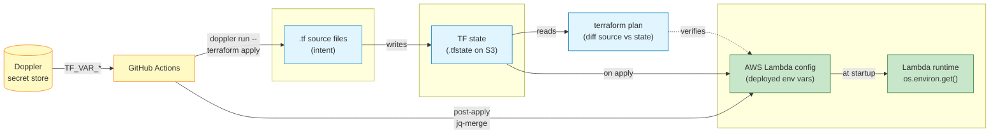
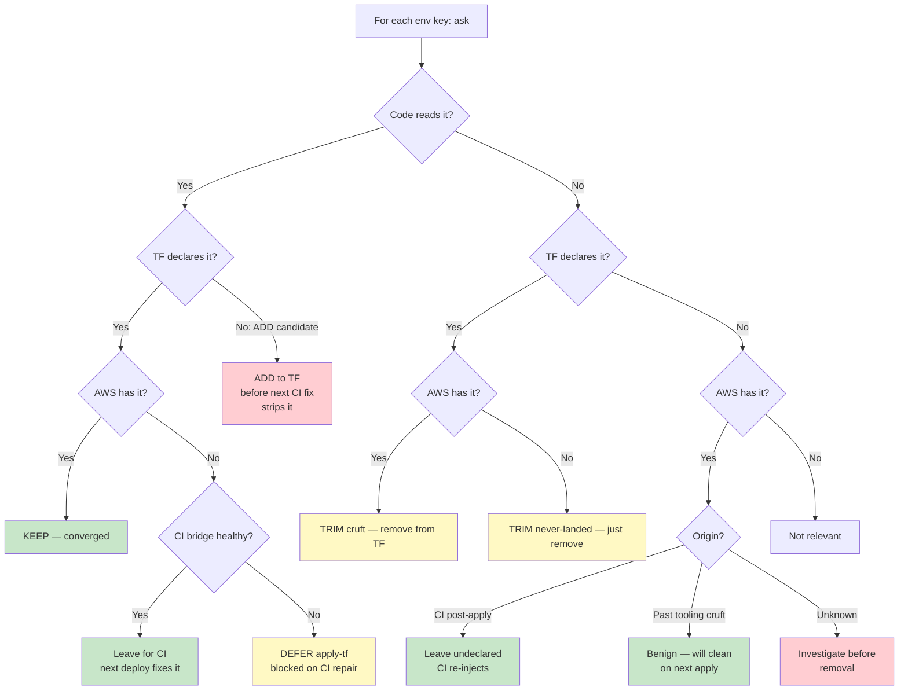
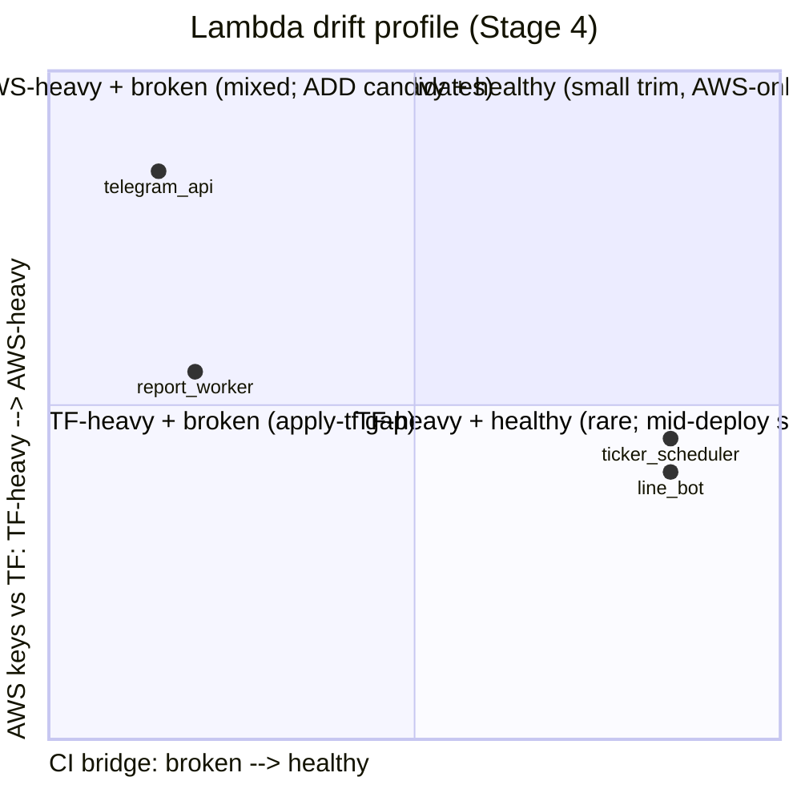
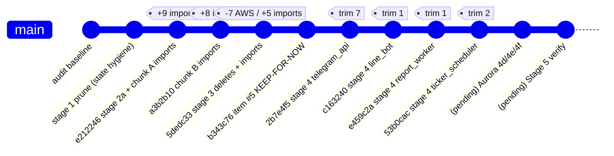

# Consolidated Knowledge: Stages 1-4 of dr-bot replica reconciliation

## Information Sources

- 4 stage commits: `e212246` (Stage 2a), `a3b2b10` (Chunk B), `5dedc33` (Stage 3),
  `b343c76` (Item #5 carve-out resolved), `2b7e4f5` (Stage 4 telegram_api),
  `c163240` (Stage 4 line_bot), `e459c2a` (Stage 4 report_worker),
  `53b0cac` (Stage 4 ticker_scheduler)
- 7 Plug #2 journals at `.claude/journals/architecture/2026-04-30-*.md` and
  `2026-05-02-*.md`
- Plan v2: `~/.claude/plans/polished-giggling-dewdrop.md`
- AWS reality (live queries): 4 Lambda env configs, 4 CI workflow histories
- Code: `src/*.py` (env var grep across all 4 Lambdas)
- Replica config: `.claude/replicas/dr-bot.yaml`

---

## Tactical Understanding

### Core mental model — the replica is 3 surfaces

The reconciliation is a **3-way comparison** between three surfaces of the
same conceptual entity:

```
TF source (.tf files)  ←──┐
                          ├── reconciled by /tf-aws skill across 3 axes
TF state (S3 .tfstate) ←──┤    δ_source, δ_membership, δ_config
                          │
AWS reality (live API) ←──┘
```

These never match perfectly. The interesting question is **how they
disagree** and **what bridges them when they do**.

### The bridge

The only pipe from source → AWS reality is `terraform apply`, executed
by CI as `doppler run -- terraform apply`. Doppler is a **deploy-time
secret injector** (provides `TF_VAR_*` env to terraform), NOT a runtime
client. The deployed Lambda has no Doppler binary, no SDK, no token
usage — it just reads its AWS-set env vars at startup.

```
Doppler (secret store)
    │
    │ TF_VAR_* env injected during CI run
    ▼
GitHub Actions ──► doppler run -- terraform apply
    │
    │ writes Lambda env config, IAM, etc.
    ▼
AWS Lambda config (env vars)
    │
    │ os.environ.get(...) at runtime
    ▼
Lambda code
```

**If the bridge breaks** (CI fails), TF source can change freely while
AWS reality stays frozen at the last successful deploy. Drift grows
**monotonically** until the bridge is repaired.

### Asymmetric drift framing — Stage 4's central insight

Plan v2's premise was wrong. It assumed a single drift direction
("Doppler injects at runtime → trim TF spec everywhere"). Reality:
the 4 in-scope Lambdas split into **two structurally different
profiles** based on their CI bridge health:

| Bridge state | Drift direction | Right action |
|---|---|---|
| **Healthy CI** (line_bot, ticker_scheduler) | TF ⊆ AWS — converged for declared, AWS-only extras = deploy-time injections + cruft | Trim cruft from TF; document AWS-only extras |
| **Broken CI** (telegram_api, report_worker via shared workflow) | TF ⊋ AWS — TF ahead of AWS, gap grows over time | Trim cruft (small; takes effect only when bridge returns); defer apply-tf gap to broken-CI fix |

**Same `/tf-aws audit` symptom ("env block mismatch") → two completely
different root causes.** Only per-Lambda evidence collection can
distinguish them.

### Per-key disposition decision tree

For any single env var, the disposition is determined by 4 questions:

1. Does code read it (`os.environ.get`/`os.getenv`)?
2. Does TF declare it?
3. Does AWS Lambda config have it?
4. Is the CI bridge healthy?

Combinations and verdicts:

| Code | TF | AWS | Verdict |
|---|---|---|---|
| ✓ | ✓ | ✓ | KEEP — converged |
| ✓ | ✓ | ❌ + healthy CI | Apply-tf will work on next deploy — leave for CI |
| ✓ | ✓ | ❌ + broken CI | DEFER (apply-tf gap blocked on bridge fix) |
| ✓ | ❌ | ✓ | **ADD candidate** — TF should declare; future apply will strip if not declared |
| ✓ | ❌ | ❌ | bug — code will get None at runtime |
| ❌ | ✓ | ✓ | TRIM (cruft) — remove from TF |
| ❌ | ✓ | ❌ | TRIM (cruft) — never landed; just remove |
| ❌ | ❌ | ✓ | AWS-only extra — classify by origin (CI-injected vs manual cruft) |
| ❌ | ❌ | ❌ | not relevant |

### AWS-only extras have 3 sub-classifications

When a key exists at AWS but TF doesn't declare it AND code doesn't read it:

1. **CI-injected post-apply** (intentional): example `LANGFUSE_RELEASE`. CI workflow
   does `aws lambda update-function-configuration` after `terraform apply`, using
   `jq` to merge the new key into the current variables map. Round-trip works:
   apply strips → CI re-injects within seconds. Don't declare in TF; don't
   `lifecycle.ignore_changes`.

2. **Dead deploy artifacts** (cruft): examples `BETA_USER_LIMIT`,
   `METRIC_REGISTRY_VERSION`, `ORIGINAL_HANDLER`. Set by past tooling
   (`scripts/deploy-interceptor.sh`, manual aws-cli, an old experiment).
   Code doesn't read them. They'll be removed on next `terraform apply` —
   benign because nothing depends on them.

3. **Hidden code dependencies** (AWS-only-but-actually-needed): example
   `ENVIRONMENT` for report_worker. Code reads it 11 times. AWS has it.
   TF doesn't declare it. **Future apply will silently break the Lambda**
   by stripping it. This is the most dangerous AWS-only category — it
   looks like cruft but isn't.

### What we actually changed (Stages 1-4 net effect)

| Stage | What | Files | Commits |
|---|---|---|---|
| 1 | State hygiene: prune 14 DOUBLE + 2 GHOST from legacy state | (TF state only) | Earlier in series |
| 2a | Rename `quant_agent_report` → `quant_agent` (cosmetic alignment) | 3 .tf files | `e212246` |
| 2b/2c | Import 17 ORPHANs (3 Lambdas + 3 aliases + 2 alarms + 2 IAM roles + 2 inline policies + 2 schedulers + 3 log groups) | `imported_orphans.tf` (new) | `e212246` + `a3b2b10` |
| 3 | 7 advisory deletes (APIGW + 2 ECS clusters + secret + 3 IAM roles); 5 imports (Grafana SG/role + 2 inline policies + ECR repo); 1 KEEP-FOR-NOW (line-bot SG, AWS DependencyViolation) | `imported_orphans.tf`, journal | `5dedc33`, `b343c76` |
| 4 (per-Lambda) | Trim 11 unused env keys across 4 Lambdas; flag 22 deferred apply-tf keys (broken CI) + 2 ADD candidates | 6 .tf files + 4 tfvars | `2b7e4f5`, `c163240`, `e459c2a`, `53b0cac` |

**State delta**: real_count 208 → 230 (+22 real bindings); 7 AWS resources deleted.

### Contradictions resolved

**Contradiction 1**: Plan v2 said *"TF over-declares because Doppler
injects at runtime."*
- **Resolution**: Falsified. Lambda Dockerfile has no Doppler binary,
  no SDK in `requirements.txt`, no code reads `DOPPLER_TOKEN_ANAK`.
  Doppler is **deploy-time-only**, not runtime.
- **Why the original claim was plausible**: `DOPPLER_TOKEN_ANAK` sits
  at AWS for telegram_api dev — looks like a runtime token. But it's
  vestigial cruft, set by a past experiment.

**Contradiction 2**: telegram_api dev Lambda has `last invocation
2026-04-28` per CloudWatch and "drift looks like cosmetic config trim"
per plan v2.
- **Resolution**: The 2026-04-28 invocation returned 500 with
  `❌ Missing required environment variables: ['OPENROUTER_API_KEY',
  'PDF_STORAGE_BUCKET']`. Lambda is broken in dev because CI deploy
  has failed since 2026-03-18. "Drift" is the symptom of broken CI,
  not benign cosmetic mismatch.
- **Asymmetric drift framing** (described above) replaces the original
  monolithic framing.

**Contradiction 3**: User reports "LINE bot in dev responds correctly
when I send ticker" — apparently contradicts "system broken."
- **Resolution**: I conflated 2 different Lambdas. LINE Bot Lambda
  works fine (its CI is healthy). Telegram Mini App API Lambda
  doesn't (its CI is broken). Same project, different deploy
  pipelines.

### Gaps identified

- **Why is `Deploy Telegram App - Dev Environment` workflow failing?**
  Haven't read the failure logs. 5 different things could cause it:
  build error, IAM permission, missing TF backend, missing Doppler
  secrets in CI, broken pre-flight check.
- **Are staging/prod telegram_api Lambdas also broken?** Single AWS
  query each would tell us. CI history shows `Deploy Telegram App
  - Prod` workflow also has failures.
- **What set `BETA_USER_LIMIT="20"`, `METRIC_REGISTRY_VERSION="1"` on
  report_worker?** Not in any tracked workflow or script. Manual
  aws-cli at some point.
- **`scripts/deploy-interceptor.sh` purpose & current relevance**: it
  flips Lambdas into a request-interceptor wrapper for logging. AWS
  reality shows the wrapper is **inactive** on LINE Bot
  (ImageConfig=null means Dockerfile CMD applies directly).
  ORIGINAL_HANDLER is dead config. But the script + wrapper code still
  exist — is this dormant-by-design (debugging tool) or fully obsolete?
- **The 6 deferred items still pending**: Stage 4d (AURORA_HOST proxy
  vs cluster), 4e (Aurora engine_version), 4f (Aurora SG ingress),
  Stage 5 verification, image_uri drift across multiple Lambdas,
  report_worker timeout drift (300s vs 120s).

### Key insights

- ✅ The replica problem is fundamentally **3-way**, not 2-way. TF
  source, TF state, and AWS reality each represent the system at
  different time horizons.
- ✅ **Drift direction matters more than drift magnitude.** A 1-key
  AWS-only "hidden code dependency" (e.g., ENVIRONMENT for report_worker)
  is more dangerous than an 18-key TF-only deferred set.
- ✅ The `noema_anchor: aws_currently_working` field in dr-bot.yaml is
  correct **for healthy-CI Lambdas**. It needs to be qualified per
  Lambda when CI is broken (then TF intent is the canonical, and
  AWS reality is degraded).
- ✅ **Plug #2 journals worked.** When the SG-deletion attempt failed
  with `DependencyViolation` and standard probes returned empty, the
  journal captured the diagnostic + KEEP-FOR-NOW disposition + 4
  re-open conditions. This is the textbook case for "intent-before-
  destructive-verb."
- ✅ **CI bridge health is the load-bearing variable.** Knowing whether
  Lambda X's CI workflow is currently working or not changes which
  reconciliation actions are safe vs blocked.

### Open questions (to resolve in future stages)

- [ ] What's the broken-CI root cause for `Deploy Telegram App -
      Dev Environment`?
- [ ] Should report_worker's `ENVIRONMENT` and `PDF_URL_EXPIRATION_HOURS`
      be proactively added to TF before CI is fixed (defensive)?
- [ ] Is `scripts/deploy-interceptor.sh` worth keeping or should it
      + `src/request_interceptor.py` be removed?
- [ ] Cross-Lambda `LOG_LEVEL` cruft (declared in ~8 other Lambda env
      blocks): single-commit sweep or per-Lambda touch?
- [ ] Aurora trio (4d/4e/4f) — proceed or defer?
- [ ] Stage 5 audit re-run — should we run before or after Aurora trio?

---

## Strategic Patterns

### Pattern 1: Bridge-Health-Aware Reconciliation

**Intent**: When TF and a runtime system disagree, the right
reconciliation depends on whether the sync mechanism is working.

**When to Use**:
- Reconciling Terraform state ↔ live infrastructure
- Reconciling source code ↔ deployed binary version
- Any "intent vs reality" reconciliation where there's a deploy/sync
  mechanism between them

**Structure**:
```
1. Identify the bridge: what mechanism syncs intent → reality?
2. Test bridge health: when did it last successfully run?
3. If healthy:
   → Reality is canonical; trim intent to match
4. If broken:
   → Document drift but DO NOT mistake it for "spec is wrong"
   → The fix is bridge repair, not intent edit
   → Trim-direction edits are safe (small effect on bridge return)
   → Apply-direction edits are blocked
5. Per-instance scoping: bridge health may differ per resource
```

**Concrete Example** (this work):
```yaml
telegram_api dev:
  bridge: deploy-telegram-dev.yml
  health: BROKEN since 2026-03-18
  drift: TF declares 27, AWS has 9
  framing: "broken bridge", not "TF over-declares"
  action: trim 7 cruft; defer 13 apply-tf

line_bot dev:
  bridge: deploy-line-dev.yml
  health: HEALTHY (last success 2026-03-18)
  drift: TF declares 13, AWS has 15 (= 13 TF + 2 deploy-time)
  framing: "converged + AWS-only extras"
  action: trim 1 cruft; document AWS-only extras
```

**Related Patterns**:
- Pull-based reconciliation (alternative bridge model — Argo CD, Flux):
  inverts which side reads from which
- Drift detection without action (audit-only, defer fix to later)

---

### Pattern 2: AWS-Only Key Triage

**Intent**: When a config key exists at the runtime but not in source-of-
truth (TF), classify before assuming "it's cruft."

**When to Use**:
- Found env var / config setting at AWS that TF doesn't declare
- Considering removing it via `terraform apply`

**Structure**:
```
For each AWS-only key, ask 3 questions:
  1. Does code read it (grep src/ for os.environ pattern)?
     → If YES: this is a hidden code dependency; ADD candidate (high priority)
     → If NO: continue
  2. Is it set by CI workflow post-apply (grep .github/workflows for the key name)?
     → If YES: deploy-time injection; leave undeclared, don't ignore_changes
     → If NO: continue
  3. Is it set by a known script or manual operation?
     → If found: dead deploy artifact (cruft); will be cleaned on next apply
     → If not found: unknown origin — investigate before removal
```

**Concrete Example** (this work):
```
report_worker AWS-only keys (6):
  ENVIRONMENT          → 11 src/ refs → ADD candidate (HIGH PRIORITY)
  PDF_URL_EXPIRATION_HOURS → 1 src/ ref → ADD candidate (low priority; default in code)
  LANGFUSE_RELEASE     → set by deploy-telegram-dev.yml jq-merge → CI-injected; leave
  BETA_USER_LIMIT      → 0 src/ refs, 0 workflow refs → cruft; benign
  METRIC_REGISTRY_VERSION → 0 refs anywhere → cruft; benign
  LOG_LEVEL            → 0 src/ refs → cruft; benign
```

**Related Patterns**:
- Config-as-code (the "everything in source" antithesis — assumes no
  AWS-only keys should exist)
- Eventually-consistent infra (intentional out-of-band updates)

---

### Pattern 3: Per-Lambda Evidence Decomposition

**Intent**: When a system has multiple instances of the same logical
component, drift profiles can be radically different per instance.
Aggregate audits hide this.

**When to Use**:
- Multi-Lambda projects, multi-cluster deployments, multi-env replicas
- Whenever "audit shows X drift" is reported and you're tempted to fix
  it at the project level

**Structure**:
```
1. Don't fix at the aggregate level (the audit's level).
2. Decompose by instance.
3. For each instance, gather:
   - Source declaration (what TF says)
   - Runtime reality (what AWS says)
   - Code dependency (what src/ reads)
   - Bridge health (when did this instance's CI last succeed?)
4. Build per-instance disposition table.
5. Commit per-instance (one Lambda per commit) for clean audit trail.
```

**Concrete Example**: This Stage 4. Same audit ("env block drift on
4 Lambdas") → 4 different per-Lambda profiles, 4 different commit
sizes (7 / 1 / 1 / 2 keys trimmed), 4 different "what's blocking the
rest" stories.

**Anti-pattern**: "Stage 4 is the env-trim stage; trim 18 keys across
4 Lambdas in one big commit." This would have:
- Trimmed needed-but-AWS-only keys (ENVIRONMENT for report_worker) →
  silent breakage on next CI fix
- Confused the broken-CI vs healthy-CI distinction
- Made rollback impossible per-Lambda

**Related Patterns**:
- Shotgun surgery anti-pattern (touching many files for one logical
  change — the inverse: don't make one logical "stage" touch many
  unrelated commits)

---

## Visual Diagrams

### Diagram 1: 3-surface replica model + bridge

**Purpose**: Show the 3-way reconciliation problem and where the deploy
bridge sits.



**What this shows**: The full pipeline from intent (left, blue) through
the deploy bridge (middle, yellow) to runtime reality (right, green).
Doppler's role is at the bridge layer — it's not in the runtime path.
The `terraform apply` step is where TF state → AWS config writes
happen. CI's post-apply jq-merge is the second AWS-mutation channel.
This is why TF can think it owns the env block but actually doesn't.

---

### Diagram 2: Per-key disposition decision tree

**Purpose**: Visualize the algorithm for classifying any single env var.



**What this shows**: The 4 questions (code-reads / TF-declares / AWS-has
/ bridge-healthy) generate 9 leaf states. The dangerous ones (red) are
where action requires deliberation: ADD candidates have a hidden code
dependency that future-apply would silently break; investigation cases
have unknown origin so removal is risky. Most "cruft" cases (yellow/
green) are routine.

---

### Diagram 3: 4-Lambda profile matrix (this Stage 4)

**Purpose**: Show how the same skill applied to 4 instances produced 4
different commit shapes.



**What this shows**: The 4 in-scope Lambdas occupy 3 quadrants:
- Top-left: telegram_api (TF declares many, AWS has few, broken CI)
- Mid-left: report_worker (mixed; partial intersection + apply-tf gap +
  AWS-only ADD candidates)
- Mid-right: line_bot, ticker_scheduler (converged with AWS-only
  deploy-time extras)

Quadrant 4 (TF-heavy + healthy) would represent a Lambda mid-deploy
that has some pending TF changes; we didn't see this in audit because
healthy-CI Lambdas had already absorbed their TF changes.

---

### Diagram 4: Stage progression + commit chain

**Purpose**: Visualize how 4 stages and ~8 commits compose the full
reconciliation.



**What this shows**: The reconciliation as a chain of small commits,
each gated by a Plug #2 journal. The Stage 4 per-Lambda decomposition
produced 4 commits instead of 1 — exactly the "Per-Lambda Evidence
Decomposition" pattern from Strategic section.

---

## Metadata

**Generated**: 2026-05-02T08:30:00Z
**Topic**: dr-bot replica reconciliation Stages 1-4 — asymmetric drift framing
**Slug**: stage-1-4-asymmetric-drift-framing
**Sources**: 8 commits, 7 journals, 1 plan, 4 Lambda live configs, 1 replica config, multi-file code grep
**Patterns Extracted**: 3 (Bridge-Health-Aware Reconciliation; AWS-Only Key Triage; Per-Lambda Evidence Decomposition)
**Diagrams**: 4 (3-surface replica + bridge; per-key disposition tree; 4-Lambda quadrant; stage gitgraph)

---

**💡 Tips**:
- This consolidation captures the **mental framework** for understanding
  what we discovered, not a step-by-step replay of the work
- Use Pattern 1 (Bridge-Health-Aware) when next reconciling any system
  with a separate deploy mechanism
- Use Pattern 2 (AWS-Only Key Triage) before ever running
  `terraform apply` after observing AWS-only keys in audit
- Use Pattern 3 (Per-Lambda Evidence Decomposition) when audit aggregates
  multiple instances; never act on the aggregate
