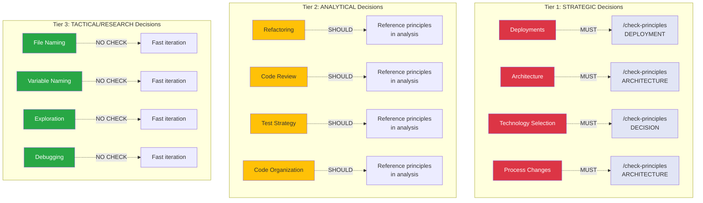
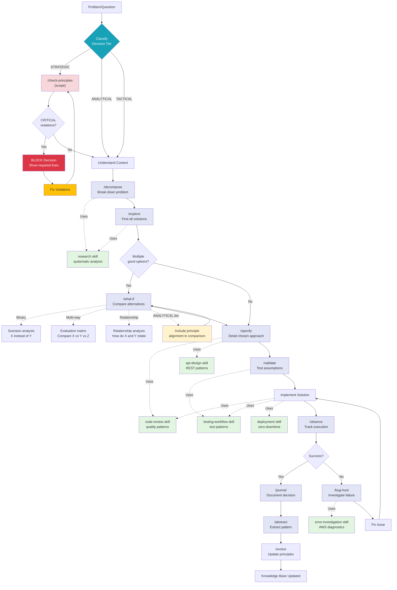
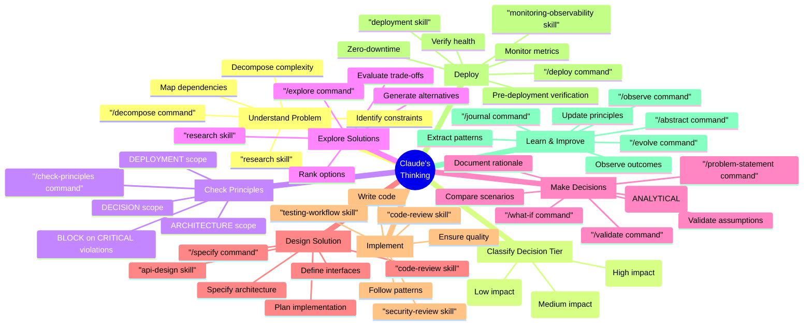

# Proposed Updates to Thinking Process Architecture

**Date**: 2026-01-04
**Changes**: Add 3-tier decision classification and principle-first workflow

---

## Summary of Changes

### 1. New Section: Decision Tiers and Principle Checking

Add new section after "## 5. Full Thinking Cycle (Decision Making)" explaining the 3-tier decision classification.

### 2. Updated Section 5: Full Thinking Cycle (Decision Making)

Replace current flowchart with updated version that includes `/check-principles` gates for strategic decisions.

### 3. Updated Section 10: Cognitive Assistance Model

Add "CHECK PRINCIPLES" node to DECIDE branch showing when principle checking is enforced.

---

## New Section to Add (Insert after Section 5)

```markdown
## 5.1 Decision Tiers and Principle Checking

Not all decisions require the same rigor. Claude classifies decisions into three tiers based on impact, reversibility, and scope.

### Three Decision Tiers



### Tier 1: STRATEGIC Decisions (MUST check principles)

**Characteristics**:
- High impact (affects system architecture, infrastructure, operations)
- Long-term consequences (difficult/expensive to reverse)
- Multi-stakeholder (affects team, users, infrastructure)
- Risk of principle violation causes major issues

**Commands that enforce principle checking**:
- `/deploy` - Already enforces `/check-principles DEPLOYMENT`
- `/architect` - Should enforce `/check-principles ARCHITECTURE`
- `/problem-statement` - Should include principle compliance matrix

**Why enforcement matters**:
- Prevents deployment failures (Principle #15: Infrastructure-Application Contract)
- Ensures monitoring discipline (Principle #6: Deployment Monitoring Discipline)
- Validates boundary testing (Principle #19: Cross-Boundary Contract Testing)
- Checks artifact promotion (Principle #11: Artifact Promotion Principle)

**Workflow**:
```
Strategic Decision Detected
    ↓
/check-principles {scope}
    ↓
Audit relevant principles
    ↓
If CRITICAL violations → BLOCK decision, show required fixes
    ↓
If clear → Proceed with analysis and decision-making
```

---

### Tier 2: ANALYTICAL Decisions (SHOULD reference principles)

**Characteristics**:
- Medium impact (affects code quality, performance, maintainability)
- Reversible (can change approach without major cost)
- Developer-facing (affects how we write code, not what system does)
- Principle violations create technical debt, not system failures

**Commands that reference principles**:
- `/what-if` - Include principle alignment in comparison
- `code-review` skill - Check patterns against principles
- `/restructure` - Reference relevant principles in recommendations

**Why reference matters**:
- Ensures defensive programming (Principle #1: Fail fast and visible)
- Validates error handling (Principle #8: Error Handling Duality)
- Checks logging patterns (Principle #18: Logging Discipline)
- Verifies test quality (Principle #10: Testing Anti-Patterns Awareness)

**Workflow**:
```
Analytical Decision
    ↓
Perform analysis
    ↓
Include principle alignment in framework
    ↓
Present options with principle considerations
    ↓
User makes decision (not blocked on violations)
```

---

### Tier 3: TACTICAL/RESEARCH Decisions (NO principle check)

**Characteristics**:
- Low impact (local changes, exploratory work)
- Highly reversible (git revert, quick iteration)
- Learning/discovery phase (don't know what decision is yet)
- Principle violations caught in code review or testing

**Commands that skip principle checking**:
- `/explore` - Research phase, no decision yet
- `/research` skill - Investigation, not decision-making
- `/trace` - Debugging, focused on root cause
- `/hypothesis` - Hypothesis generation, exploration

**Why no check needed**:
- Decision scope too small to violate principles
- Enforcement adds friction without benefit
- Code review catches issues later
- Slows iteration during learning/debugging

**Workflow**:
```
Tactical/Research Decision
    ↓
Fast iteration (no gate)
    ↓
Code review catches violations (if any)
```

---

### Decision Tier Classification Heuristic

**When Claude encounters a decision**, classify using:

| Criterion | Strategic | Analytical | Tactical |
|-----------|-----------|------------|----------|
| **Impact** | System-wide | Module-level | Local |
| **Reversibility** | Expensive | Moderate | Cheap |
| **Scope** | Multi-component | Single component | File/function |
| **Duration** | Long-term | Medium-term | Short-term |
| **Stakeholders** | Team + users | Developers | Individual |

**Examples by tier**:

| Decision | Tier | Reason |
|----------|------|--------|
| "Deploy Lambda timeout increase" | STRATEGIC | Infrastructure change, affects reliability |
| "Choose Redis vs DynamoDB" | STRATEGIC | Technology selection, long-term commitment |
| "Refactor this function" | ANALYTICAL | Code quality, reversible |
| "Name this variable" | TACTICAL | Local scope, trivial to change |
| "Explore authentication patterns" | TACTICAL | Research, no decision yet |

---

### Integration with Existing Workflow

**Current workflow** (Section 5):
```
Problem → Decompose → Explore → Specify → Validate → Implement
```

**Updated workflow** (with principle checking):
```
Problem
    ↓
Classify Decision Tier
    ↓
If STRATEGIC → /check-principles {scope}
    ↓
If ANALYTICAL → Reference principles in analysis
    ↓
If TACTICAL → Skip principle check
    ↓
Decompose → Explore → Specify → Validate → Implement
```

---
```

## Updated Section 5: Full Thinking Cycle (Decision Making)

Replace current Section 5 content with:

```markdown
## 5. Full Thinking Cycle (Decision Making with Principle Checking)



**Full cycle with principle checking**:
```
Problem
    → Classify Decision Tier (STRATEGIC/ANALYTICAL/TACTICAL)
    → [If STRATEGIC] Check Principles (BLOCK if violations)
    → [If ANALYTICAL] Reference Principles (include in analysis)
    → [If TACTICAL] Skip principle check (fast iteration)
    → Decompose → Explore → Specify → Validate → Implement
    → Observe → Document → Learn
```

**Key changes from previous version**:
1. **Added CLASSIFY node** - Determines decision tier before proceeding
2. **Added CHECK_PRINCIPLES gate** - Enforced for STRATEGIC decisions only
3. **Added BLOCK path** - CRITICAL violations prevent decision progression
4. **Added REF_PRINCIPLES note** - ANALYTICAL decisions include principle alignment
5. **Color coding** - Red (strategic gate), Yellow (analytical reference), Blue (tactical skip)
```

## Updated Section 10: Cognitive Assistance Model

Replace current Section 10 mindmap with:

```markdown
## 10. Cognitive Assistance Model (with Principle Checking)



**New nodes**:
- **CLASSIFY**: Decision tier classification (determines if principle checking needed)
- **CHECK_PRINCIPLES**: Principle compliance audit (enforced for STRATEGIC decisions)

**Integration with existing flow**:
```
UNDERSTAND → CLASSIFY → [If STRATEGIC] CHECK_PRINCIPLES → EXPLORE → DECIDE → ...
```
```

---

## Additional Changes

### Update Section Summary

Update the "Summary: How It All Works Together" section to include decision tier classification:

**Before**:
```markdown
### The Full Cycle
\`\`\`
User Problem
    ↓
Commands orchestrate workflow
    ↓
Skills guide methodology
    ↓
System Prompt constrains decisions
    ↓
Tools execute actions
    ↓
Outputs generated
    ↓
Feedback updates knowledge base
\`\`\`
```

**After**:
```markdown
### The Full Cycle (with Principle Checking)
\`\`\`
User Problem
    ↓
Classify Decision Tier (STRATEGIC/ANALYTICAL/TACTICAL)
    ↓
[If STRATEGIC] Check Principles (MUST gate)
[If ANALYTICAL] Reference Principles (SHOULD include)
[If TACTICAL] Skip Principles (NO check)
    ↓
Commands orchestrate workflow
    ↓
Skills guide methodology
    ↓
System Prompt constrains decisions
    ↓
Tools execute actions
    ↓
Outputs generated
    ↓
Feedback updates knowledge base
\`\`\`
```

---

## Files to Modify

1. **`.claude/diagrams/thinking-process-architecture.md`**:
   - Add new Section 5.1 (Decision Tiers and Principle Checking)
   - Replace Section 5 (Full Thinking Cycle)
   - Replace Section 10 (Cognitive Assistance Model)
   - Update Summary section

2. **Create new evolution report**:
   - `.claude/evolution/2026-01-04-thinking-architecture-principle-checking.md`
   - Document rationale for changes
   - Link to principle-first-decision-workflow.md analysis

---

## Benefits of These Changes

**Clarity**:
- Explicit decision tier classification (no ambiguity about when to check principles)
- Visual representation in diagrams (color-coded by tier)
- Clear workflow integration (shows where principle checking fits)

**Consistency**:
- All decision-making commands follow same tier classification
- Principle checking enforced systematically for strategic decisions
- Analytical decisions reference principles consistently

**Discoverability**:
- New users see decision tiers in architecture diagram
- Understanding when to use `/check-principles` is clearer
- Integration with existing thinking process is explicit

---

## Next Steps

1. Review proposed changes with user
2. If approved, update `.claude/diagrams/thinking-process-architecture.md`
3. Create evolution report documenting changes
4. Update related commands (` /architect`, `/problem-statement`) to match new workflow
