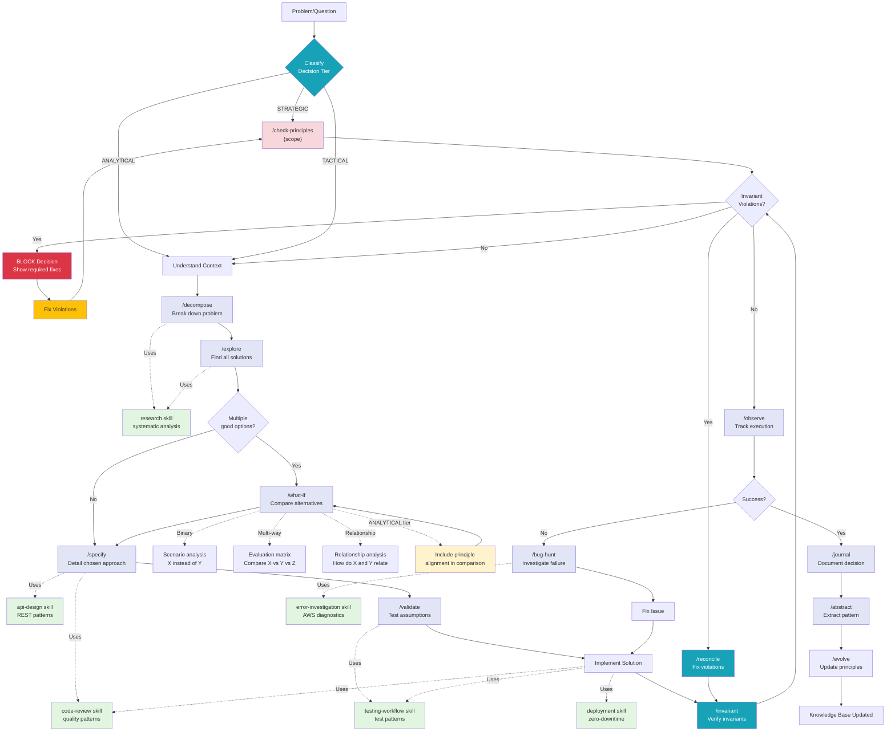
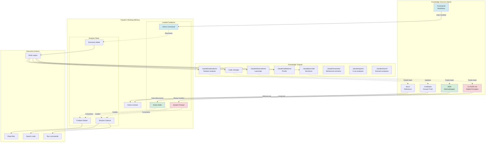
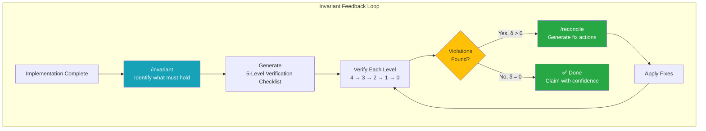
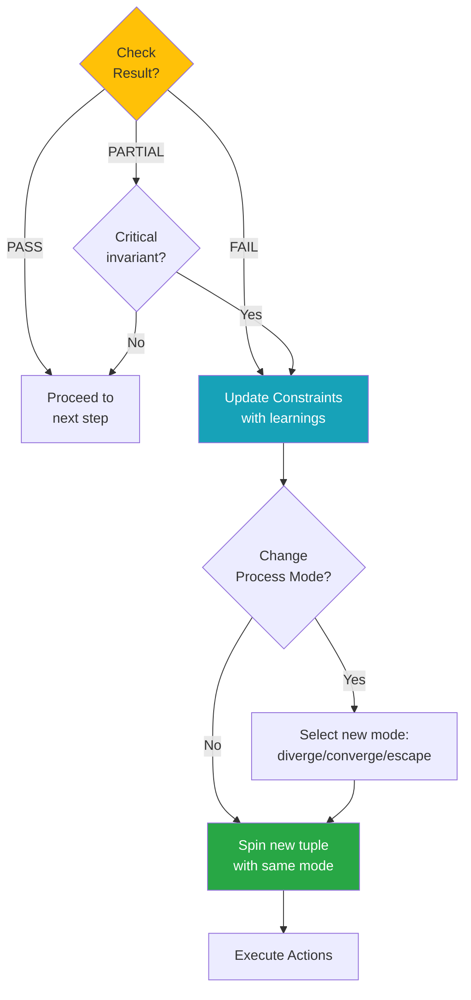

# Claude's Thinking Process Architecture

**How Skills and Commands Guide Claude's Cognition**

---

## 1. High-Level Architecture

```mermaid
graph TB
    subgraph "User Layer"
        U[User]
    end

    subgraph "Interface Layer"
        CMD["/commands<br/>(User-Invoked)"]
        CHAT[Natural Language]
    end

    subgraph "Claude's Cognitive Layer"
        CLAUDE[Claude Code Session]
        SKILLS[Skills<br/>(Auto-Discovered)]
        SYSPROMPT[System Prompt<br/>CLAUDE.md]
    end

    subgraph "Execution Layer"
        TOOLS[Tools<br/>(Read, Write, Bash, etc.)]
        MCP[MCP Servers<br/>(AWS, GitHub, etc.)]
    end

    subgraph "Storage Layer"
        FILES[".claude/ Files"]
        CODEBASE["Codebase<br/>(src/, docs/)"]
    end

    U -->|1. Invokes| CMD
    U -->|2. Asks| CHAT

    CMD -->|Orchestrates| CLAUDE
    CHAT -->|Processed by| CLAUDE

    CLAUDE -->|Reads guidance from| SKILLS
    CLAUDE -->|Follows principles from| SYSPROMPT

    SKILLS -.->|"Auto-discovered<br/>(when relevant)"| CLAUDE

    CLAUDE -->|Uses| TOOLS
    CLAUDE -->|Uses| MCP

    TOOLS -->|Read/Write| FILES
    TOOLS -->|Read/Write| CODEBASE
    MCP -->|Access| EXT[External Systems]

    style SKILLS fill:#e1f5e1
    style CMD fill:#e1e5f5
    style SYSPROMPT fill:#f5e1e1
    style CLAUDE fill:#fff4e1
```

**Key principles**:
- **Commands** = User-invoked workflows (explicit)
- **Skills** = Auto-discovered knowledge (implicit)
- **System Prompt** = Always-active principles (global)
- **Claude** = Orchestrator (applies all guidance)

---

## 2. Command Execution Flow


**Flow**:
1. User invokes command with arguments
2. Command loads workflow template
3. Claude auto-discovers relevant skills
4. Skills guide HOW to approach problem
5. Claude executes using tools
6. Output generated per command spec

---

## 3. Skill Auto-Discovery Flow


**Discovery logic**:
- Claude analyzes task intent
- Matches to skill domain (debugging → research, code → code-review)
- Loads skill methodology automatically
- Applies "how to" guidance from skill
- User never explicitly invokes skills (auto-discovered)

---

### 3.1 Progressive Evidence Strengthening Pattern

**Universal verification principle**: Evidence sources have natural strength hierarchies. Always verify from weakest to strongest, never stop at surface signals.

**Pattern structure**:
```
Weak Evidence → Stronger Evidence → Strongest Evidence
     ↓                  ↓                    ↓
  Confirms          Validates            Proves
  execution         correctness          ground truth
```

**Domain instantiations**:

| Domain | Surface | Content | Observability | Ground Truth |
|--------|---------|---------|---------------|--------------|
| HTTP APIs | Status code | Response payload | Application logs | Database state |
| File ops | Exit code | File content | System logs | Disk state |
| Database | Rowcount | Query result | DB logs | Table inspection |
| Testing | Test passed | Output matches | No error logs | Side effects correct |
| Deployments | Process exit | Health checks | CloudWatch logs | Traffic metrics |

**Anti-pattern**: Trusting weak evidence
```python
# WRONG: Stop at surface signal
if response.status_code == 200:
    return "Success"  # But payload might be error!

# CORRECT: Progress to ground truth
if response.status_code == 200:
    if validate_schema(response.json()):
        if check_logs_clean():
            if verify_database_state():
                return "Verified success"
```

**Application in commands**:
- `/validate`: Should progress through all evidence layers (currently stops at surface)
- `/verify` (proposed): Always enforces full hierarchy
- `/bug-hunt`: Should check data integrity (ground truth), not just existence (surface)

---

## 4. Thinking Process: Commands + Skills + Tools


**Pattern**: Commands orchestrate workflow, Skills guide methodology

---

## 5. Full Thinking Cycle (Decision Making with Principle Checking)



**Full cycle with principle checking and invariant verification**:
```
Problem
    → Classify Decision Tier (STRATEGIC/ANALYTICAL/TACTICAL)
    → [If STRATEGIC] Check Principles (BLOCK if violations)
    → [If ANALYTICAL] Reference Principles (include in analysis)
    → [If TACTICAL] Skip principle check (fast iteration)
    → Decompose → Explore → Specify → Validate → Implement
    → /invariant (verify invariants hold)
    → [If violations] /reconcile → /invariant (loop until delta = 0)
    → Observe → Document → Learn
```

**Key changes from previous version**:
1. **Added CLASSIFY node** - Determines decision tier before proceeding
2. **Added CHECK_PRINCIPLES gate** - Enforced for STRATEGIC decisions only
3. **Added BLOCK path** - CRITICAL violations prevent decision progression
4. **Added REF_PRINCIPLES note** - ANALYTICAL decisions include principle alignment
5. **Added INVARIANT verification** - After implementation, verify behavioral invariants
6. **Added RECONCILE loop** - Fix violations and re-verify until delta = 0
7. **Color coding** - Red (strategic gate), Yellow (analytical reference), Teal (invariant verification)

---

## 5.1 Decision Tiers and Principle Checking

Not all decisions require the same rigor. Claude classifies decisions into three tiers based on impact, reversibility, and scope.

### Three Decision Tiers


### Tier 1: STRATEGIC Decisions (MUST check principles)

**Characteristics**:
- High impact (affects system architecture, infrastructure, operations)
- Long-term consequences (difficult/expensive to reverse)
- Multi-stakeholder (affects team, users, infrastructure)
- Risk of principle violation causes major issues

**Commands that enforce principle checking**:
- `/deploy` - Already enforces `/check-principles DEPLOYMENT`
- `/architect` - Should enforce `/check-principles ARCHITECTURE`
- `/problem-statement` - Should include principle compliance matrix

**Why enforcement matters**:
- Prevents deployment failures (Principle #15: Infrastructure-Application Contract)
- Ensures monitoring discipline (Principle #6: Deployment Monitoring Discipline)
- Validates boundary testing (Principle #19: Cross-Boundary Contract Testing)
- Checks artifact promotion (Principle #11: Artifact Promotion Principle)

**Workflow**:
```
Strategic Decision Detected
    ↓
/check-principles {scope}
    ↓
Audit relevant principles
    ↓
If CRITICAL violations → BLOCK decision, show required fixes
    ↓
If clear → Proceed with analysis and decision-making
```

---

### Tier 2: ANALYTICAL Decisions (SHOULD reference principles)

**Characteristics**:
- Medium impact (affects code quality, performance, maintainability)
- Reversible (can change approach without major cost)
- Developer-facing (affects how we write code, not what system does)
- Principle violations create technical debt, not system failures

**Commands that reference principles**:
- `/what-if` - Include principle alignment in comparison
- `code-review` skill - Check patterns against principles
- `/restructure` - Reference relevant principles in recommendations

**Why reference matters**:
- Ensures defensive programming (Principle #1: Fail fast and visible)
- Validates error handling (Principle #8: Error Handling Duality)
- Checks logging patterns (Principle #18: Logging Discipline)
- Verifies test quality (Principle #10: Testing Anti-Patterns Awareness)

**Workflow**:
```
Analytical Decision
    ↓
Perform analysis
    ↓
Include principle alignment in framework
    ↓
Present options with principle considerations
    ↓
User makes decision (not blocked on violations)
```

---

### Tier 3: TACTICAL/RESEARCH Decisions (NO principle check)

**Characteristics**:
- Low impact (local changes, exploratory work)
- Highly reversible (git revert, quick iteration)
- Learning/discovery phase (don't know what decision is yet)
- Principle violations caught in code review or testing

**Commands that skip principle checking**:
- `/explore` - Research phase, no decision yet
- `/research` skill - Investigation, not decision-making
- `/trace` - Debugging, focused on root cause
- `/hypothesis` - Hypothesis generation, exploration

**Why no check needed**:
- Decision scope too small to violate principles
- Enforcement adds friction without benefit
- Code review catches issues later
- Slows iteration during learning/debugging

**Workflow**:
```
Tactical/Research Decision
    ↓
Fast iteration (no gate)
    ↓
Code review catches violations (if any)
```

---

### Decision Tier Classification Heuristic

**When Claude encounters a decision**, classify using:

| Criterion | Strategic | Analytical | Tactical |
|-----------|-----------|------------|----------|
| **Impact** | System-wide | Module-level | Local |
| **Reversibility** | Expensive | Moderate | Cheap |
| **Scope** | Multi-component | Single component | File/function |
| **Duration** | Long-term | Medium-term | Short-term |
| **Stakeholders** | Team + users | Developers | Individual |

**Examples by tier**:

| Decision | Tier | Reason |
|----------|------|--------|
| "Deploy Lambda timeout increase" | STRATEGIC | Infrastructure change, affects reliability |
| "Choose Redis vs DynamoDB" | STRATEGIC | Technology selection, long-term commitment |
| "Refactor this function" | ANALYTICAL | Code quality, reversible |
| "Name this variable" | TACTICAL | Local scope, trivial to change |
| "Explore authentication patterns" | TACTICAL | Research, no decision yet |

---

### Integration with Existing Workflow

**Current workflow** (Section 5):
```
Problem → Decompose → Explore → Specify → Validate → Implement
```

**Updated workflow** (with principle checking):
```
Problem
    ↓
Classify Decision Tier
    ↓
If STRATEGIC → /check-principles {scope}
    ↓
If ANALYTICAL → Reference principles in analysis
    ↓
If TACTICAL → Skip principle check
    ↓
Decompose → Explore → Specify → Validate → Implement
```

---

### Metacognitive Commands (Thinking About Thinking)

Beyond problem-solving commands, Claude uses metacognitive tools to monitor and adjust its own thinking process.

#### `/reflect` - Analyze Actions and Reasoning

**Purpose**: Understand what happened and why you did what you did

**Output**: Pattern recognition, effectiveness assessment, behavioral insights

**When to use**:
- After completing a task (synthesize learnings)
- When stuck in a loop (detect patterns)
- Before escalating to different approach (meta-loop trigger)

**Relationship to Loops**:
- **Meta-loop trigger**: Reveals when current loop type isn't working
- **Pattern detection**: "I've tried 3 fixes with same error" → stuck signal
- **Effectiveness assessment**: Determines if current strategy making progress

**Example**:
```
/reflect
→ Pattern: Same /trace output 3 times (stuck in retrying loop)
→ Assessment: Execution varies but outcome identical
→ Meta-loop trigger: Escalate to initial-sensitive (question assumptions)
```

---

#### `/understand {concept}` - Build Mental Model

**Purpose**: Internal understanding (for Claude) + external explanation (for user)

**Prerequisite**: None (but often follows `/research`)

**Output**: Mental model, connections, explanations

**When to use**:
- Research skill (build understanding from investigation)
- Initial-sensitive loop (check if assumptions correct)
- Before explaining to user (ensure comprehension first)

**Relationship to Loops**:
- **Initial-sensitive**: Reveals faulty assumptions about system
- **Synchronize**: Aligns mental model with reality

**Generalization of**: `/explain` (which focuses on communication step only)

---

#### `/hypothesis {observation}` - Construct Explanations

**Purpose**: Ask "why" and construct plausible paths to explore

**Prerequisite**: Requires `/observe` output (need something to explain)

**Output**: Testable hypotheses, predictions, evidence needed

**When to use**:
- Before `/research` (generate what to investigate)
- Initial-sensitive loop (propose alternative assumptions)
- Root cause analysis (generate candidate causes)

**Relationship to Loops**:
- **Initial-sensitive**: Generates new assumptions to test
- **Retrying**: Proposes alternative root causes

**Workflow**: `/observe` → `/hypothesis` → `/research` → `/validate`

---

#### `/consolidate {topic}` - Synthesize Knowledge

**Purpose**: Gather → Understand → Consolidate → Communicate

**Superset of**: `/summary` (which only communicates final result)

**Output**: Unified coherent model, contradictions resolved, gaps identified

**When to use**:
- Synchronize loop (ensure knowledge coherence)
- Knowledge evolution (after learning from multiple sources)
- Before major decision (unify understanding)

**Relationship to Loops**:
- **Synchronize**: Ensures knowledge aligns with reality
- **Meta-loop**: Synthesizes learnings across loop iterations

**Steps**:
1. **Gather**: Collect information from sources
2. **Understand**: Build mental model
3. **Consolidate**: Resolve contradictions, fill gaps
4. **Communicate**: Present unified view

---

#### `/impact {change}` - Assess Change Scope

**Purpose**: Identify affected artifacts (direct + cascading effects)

**Output**: Ripple analysis (Level 1/2/3 effects), risk assessment

**When to use**:
- Branching loop (evaluate consequences of each path)
- Before major changes (understand blast radius)
- Architecture decisions (assess system-wide impact)

**Relationship to Loops**:
- **Branching**: Evaluates path consequences
- **Meta-loop**: Assesses impact of changing loop type

**Levels**:
- **Level 1**: Direct effects (files/modules explicitly changed)
- **Level 2**: Cascading effects (dependencies affected)
- **Level 3**: Indirect effects (assumptions, patterns, principles)

---

#### `/compare {A} vs {B}` - Structured Comparison

**Purpose**: Contrast alternatives across dimensions

**Output**: Trade-off analysis, decision criteria, recommendation

**When to use**:
- Branching loop (choose between paths)
- Choosing between approaches
- Evaluating trade-offs

**Relationship to Loops**:
- **Branching**: Evaluates multiple paths systematically
- **Meta-loop**: Compares loop types (which loop to use)

**Note**: `/compare` invokes `/what-if` with comparison mode. `/what-if` is broader (single scenario analysis), `/compare` is specialized (multi-alternative comparison).

---

#### `/trace {event} [forward|backward]` - Follow Causality

**Purpose**: Trace implications (forward) or root cause (backward)

**Output**: Causal chains (Event → Consequence OR Event ← Cause)

**When to use**:
- Retrying loop (find root cause of failure)
- Meta-loop (trace implications of decisions)
- Impact analysis (forward trace from change)

**Relationship to Loops**:
- **Retrying**: Backward trace to find root cause
- **Meta-loop**: Forward trace to understand implications

**Modes**:
- **Backward**: Event ← Cause ← Root (debugging)
- **Forward**: Event → Effect → Consequence (prediction)

---

### Tool Prerequisites (Workflow Ordering)

Natural ordering emerges from tool prerequisites (no hardcoded workflows):

```
/observe (notice phenomenon)
    ↓
/hypothesis (explain why) - REQUIRES: /observe output
    ↓
/research (test hypothesis) - REQUIRES: /hypothesis
    ↓
/validate (check claim) - REQUIRES: /research evidence
/proof (derive theorem) - REQUIRES: /research evidence
    ↓
/reflect (synthesize) - REQUIRES: completed work
    ↓
/consolidate (unify knowledge) - REQUIRES: /reflect insights
```

**Key principle**: Workflow emerges from tool design (self-documenting)

**Why prerequisites matter**:
- `/validate` and `/proof` require evidence → must follow `/research`
- `/hypothesis` requires observation → must follow `/observe`
- `/consolidate` requires insights → must follow `/reflect`
- `/reflect` requires completed work → comes after task completion

**Example workflow** (debugging):
```
/observe (notice failure)
    → /hypothesis (why might this fail?)
    → /research (test each hypothesis)
    → /validate (which hypothesis correct?)
    → /trace (find root cause)
    → /reflect (what pattern do I see?)
    → /consolidate (synthesize understanding)
```

---

## 6. Skill Types in Thinking Process


**Pattern**: Generalized (HOW to think) + Domain-specific (WHAT to apply) = Complete solution

---

## 7. Command Composition Pattern

```mermaid
graph LR
    subgraph "Meta-Cognitive Commands"
        MC1[/decompose]
        MC2[/abstract]
        MC3[/evolve]
        MC4[/reflect]
    end

    subgraph "Exploration Commands"
        EX1[/explore]
        EX2[/what-if]
        EX3[/specify]
    end

    subgraph "Validation Commands"
        V1[/validate]
        V2[/proof]
    end

    subgraph "Verification Commands"
        VER1[/invariant]
        VER2[/reconcile]
    end

    subgraph "Inspection Commands"
        INSP1[/x-ray]
        INSP2[/locate]
    end

    subgraph "Design Commands"
        DES1[/design]
        DES2[/problem-statement]
    end

    subgraph "Documentation Commands"
        D1[/journal]
        D2[/observe]
    end

    subgraph "Workflow Commands"
        W1[/bug-hunt]
        W2[/restructure]
        W3[/deploy]
    end

    MC1 -->|"Feeds into"| EX1
    EX1 -->|"Feeds into"| EX2
    EX2 -->|"Feeds into"| EX3
    EX3 -->|"Feeds into"| V1
    V1 -->|"If valid"| IMPL[Implementation]
    IMPL -->|"Verify"| VER1
    VER1 -->|"If violations"| VER2
    VER2 -->|"Fix & re-verify"| VER1
    VER1 -->|"If clean"| D2
    D2 -->|"Document"| D1
    D1 -->|"Extract patterns"| MC2
    MC2 -->|"Update principles"| MC3

    INSP1 -->|"Informs"| DES1
    DES1 -->|"Feeds into"| EX3

    W1 -.->|"Uses"| MC1
    W1 -.->|"Uses"| D2
    W1 -.->|"Uses"| D1

    W2 -.->|"Uses"| MC1
    W2 -.->|"Uses"| V1

    W3 -.->|"Uses"| VER1
    W3 -.->|"Uses"| VER2

    style MC1 fill:#fff3cd
    style MC2 fill:#fff3cd
    style MC3 fill:#fff3cd
    style MC4 fill:#fff3cd

    style EX1 fill:#d1ecf1
    style EX2 fill:#d1ecf1
    style EX3 fill:#d1ecf1

    style V1 fill:#d4edda
    style V2 fill:#d4edda

    style VER1 fill:#17a2b8,color:#fff
    style VER2 fill:#17a2b8,color:#fff

    style INSP1 fill:#6f42c1,color:#fff
    style INSP2 fill:#6f42c1,color:#fff

    style DES1 fill:#fd7e14,color:#fff
    style DES2 fill:#fd7e14,color:#fff

    style D1 fill:#f8d7da
    style D2 fill:#f8d7da

    style W1 fill:#e2e3e5
    style W2 fill:#e2e3e5
    style W3 fill:#e2e3e5
```

**Composition**: Commands build on each other:
- **Main flow**: decompose → explore → specify → validate → implement → **invariant → reconcile** → observe → journal → abstract → evolve
- **Inspection flow**: x-ray → design → specify
- **Verification loop**: invariant ↔ reconcile (until delta = 0)

---

## 8. Information Flow Architecture



**Flow**: Knowledge sources → Claude's working memory → Execution → Knowledge outputs → Feedback loop

---

## 9. Thinking Layers (Abstraction Hierarchy)


**Hierarchy**:
- **Layer 1** (Principles): Rarely change, foundational
- **Layer 2** (Methodologies): Generalized thinking patterns
- **Layer 3** (Domain): Technology-specific knowledge
- **Layer 4** (Workflows): Orchestration and composition
- **Layer 5** (Execution): Active session state

**Feedback loops**: Execution results feed back to update higher layers

---

## 10. Cognitive Assistance Model (with Principle Checking)


**New nodes**:
- **CLASSIFY**: Decision tier classification (determines if principle checking needed)
- **CHECK_PRINCIPLES**: Principle compliance audit (enforced for STRATEGIC decisions)

**Integration with existing flow**:
```
UNDERSTAND → CLASSIFY → [If STRATEGIC] CHECK_PRINCIPLES → EXPLORE → DECIDE → ...
```

---

## Summary: How It All Works Together

### Commands (Blue boxes)
- **User-invoked** workflows
- **Orchestrate** the thinking process
- **Compose** with other commands
- **Example**: `/explore` → `/what-if` → `/specify` → `/validate`

### Skills (Green boxes)
- **Auto-discovered** by Claude
- **Guide** HOW to approach problems
- **Apply** methodology automatically
- **Example**: When debugging, `research` + `error-investigation` skills activate

### System Prompt (Red boxes)
- **Always active** principles
- **Constrain** all decisions
- **Foundational** rules
- **Example**: CLAUDE.md principles always enforced

### Tools (Gray boxes)
- **Execute** concrete actions
- **Access** files and systems
- **Produce** outputs
- **Example**: Read, Write, Bash, MCP tools

### The Full Cycle (with Principle Checking)
```
User Problem
    ↓
Classify Decision Tier (STRATEGIC/ANALYTICAL/TACTICAL)
    ↓
[If STRATEGIC] Check Principles (MUST gate)
[If ANALYTICAL] Reference Principles (SHOULD include)
[If TACTICAL] Skip Principles (NO check)
    ↓
Commands orchestrate workflow
    ↓
Skills guide methodology
    ↓
System Prompt constrains decisions
    ↓
Tools execute actions
    ↓
Outputs generated
    ↓
Feedback updates knowledge base
```

**Result**: Claude thinks systematically, consistently, and learns over time.

---

## 11. Feedback Loop Types (Self-Healing Properties)

Claude's thinking process includes self-healing mechanisms through five fundamental feedback loop types. These loops enable recovery from failures and continuous improvement.

### Progress as Gradient (Implicit, Not Measured)

**Principle**: Failure is not binary (0 or 1), but a gradient (0.0 to 1.0)

**Gradient Definition**:
- **1.0**: Goal fully achieved
- **0.5**: Halfway toward goal (making progress)
- **0.0**: Maximum distance from goal (complete failure)

**Failure Redefined**: "Step taken moves away from goal"
- **Negative gradient** (moving from 0.5 → 0.3) = failure (regressing)
- **Positive gradient** (moving from 0.3 → 0.5) = progress (improving)
- **Zero gradient** (stuck at 0.3) = no progress (trigger for escalation, not failure itself)

**Key Insight**: "Not reaching goal" ≠ failure
- Progress (0.0 → 0.7) without reaching goal (1.0) = still success (moving in right direction)
- Regression (0.7 → 0.5) even if above baseline = failure (moved away from goal)

**Relationship to Thinking Tools**:
- Gradient is **implicit** (not measured explicitly)
- Tools reveal gradient through patterns:
  - Same `/trace` output repeatedly = zero gradient (stuck)
  - Different `/trace` output each time = positive gradient (learning)
  - `/reflect` makes gradient patterns visible ("I'm stuck" or "I'm making progress")
- **No numeric measurement required** - pattern recognition sufficient

---

### Five Fundamental Loop Types

#### 1. Retrying Loop (Single-Loop Learning)

**What changes**: Execution (HOW), strategy unchanged

**When to use**: First occurrence of failure, execution error

**Tools**: `/trace` (find root cause), `/validate` (test fix)

**Example**:
```
Bug: Lambda timeout
→ /trace → Root cause: N+1 query
→ Fix: Add batch loading
→ /validate → Still timing out
→ /trace → Root cause: Still N+1 (different location)
→ Fix: Add caching
→ /validate → Success
```

**Escalation signal**: Same `/trace` output repeatedly (stuck)

---

#### 2. Initial-Sensitive Loop (Double-Loop Learning)

**What changes**: Assumptions/initial state (WHAT), approach unchanged

**When to use**: Execution varies but outcome identical, assumptions might be wrong

**Tools**: `/qna` (surface knowledge state), `/hypothesis` (generate alternatives), `/research` (test), `/validate` (check)

**Two types of blockers**:
- **Knowledge gaps** (incomplete information): Claude doesn't have information needed to proceed
- **Incorrect assumptions** (incorrect information): Claude has wrong beliefs about how something works

**Example with `/qna` self-interviewing**:
```
After 3 retrying attempts with same failure:
→ /reflect → "Execution varies, outcome identical"
→ /qna "{stuck problem}" → Surface knowledge state for user verification
  → Confident: "Lambda uses Python 3.11"
  → Assumed: "Cache invalidates on data change"  ← Might be wrong!
  → Unknown: "How TTL is configured"
→ User: "Actually, cache uses fixed 15-min TTL, doesn't invalidate on change"
→ /hypothesis → Generate alternatives with corrected knowledge
→ /research → Test alternative assumption
→ /validate → New assumption correct
→ Success with different starting point
```

**Why `/qna` before `/hypothesis`**:
Without surfacing current beliefs, Claude might generate hypotheses that are all wrong because they're based on faulty assumptions. `/qna` lets the user correct incorrect knowledge BEFORE exploring alternatives.

**Escalation signal**: `/validate` fails multiple hypotheses

---

#### 3. Branching Loop (Double-Loop Learning)

**What changes**: Exploration path (WHERE), problem unchanged

**When to use**: Multiple approaches needed, current path inadequate

**Tools**: `/compare` (evaluate paths), `/impact` (assess consequences)

**Example**:
```
Problem: Improve API performance
→ Path 1: Caching → /impact → Limited gains
→ Path 2: Query optimization → /impact → Better but complex
→ Path 3: Async processing → /impact → Best trade-off
→ /compare → Choose async processing
```

**Escalation signal**: `/impact` shows all paths inadequate

---

#### 4. Synchronize Loop (Single/Double-Loop Learning)

**What changes**: Knowledge alignment with reality

**When to use**: Drift detected, knowledge outdated (NOT failure-driven)

**Tools**: `/validate` (check reality), `/consolidate` (align knowledge)

**Example**:
```
Documentation says API uses JWT, code uses sessions
→ /validate → Code reality = sessions
→ /consolidate → Update mental model
→ Documentation updated
```

**Escalation signal**: Drift recurring despite `/consolidate`

---

#### 5. Meta-Loop (Triple-Loop Learning)

**What changes**: Loop type itself (PERSPECTIVE)

**When to use**: Current loop type not making progress, perspective shift needed

**Tools**: `/reflect` (detect stuck pattern), `/compare` (evaluate loop types)

**Example**:
```
After multiple retrying attempts:
→ /reflect → "I'm stuck in retrying loop"
→ Pattern: Execution changes but outcome doesn't
→ Meta-loop trigger: Switch to initial-sensitive
→ /hypothesis → Question assumptions instead
```

**Escalation signal**: `/reflect` reveals loop type ineffective

---

### Escalation via Thinking Tools

**Retrying → Initial-Sensitive**:
- **Tool signal**: `/trace` shows same root cause repeatedly
- **`/reflect` reveals**: "Execution varies but outcome identical"
- **Pattern**: Retrying loop isn't working
- **Escalate**:
  1. Use `/qna` to surface current knowledge state for user verification
  2. User corrects any incorrect assumptions or fills knowledge gaps
  3. Use `/hypothesis` to generate alternatives with corrected knowledge

**Initial-Sensitive → Branching**:
- **Tool signal**: `/validate` shows multiple assumptions all fail
- **`/reflect` reveals**: "Assumptions vary but all wrong"
- **Pattern**: Initial-sensitive loop isn't working
- **Escalate**: Use `/compare` to evaluate different paths (branching)

**Branching → Meta-Loop**:
- **Tool signal**: `/impact` shows all paths inadequate
- **`/reflect` reveals**: "Multiple paths explored, none work"
- **Pattern**: Branching loop isn't working
- **Escalate**: Use `/reflect` to question problem framing (meta-loop)

**Synchronize → Meta-Loop**:
- **Tool signal**: `/validate` shows drift recurring despite sync
- **`/reflect` reveals**: "Synchronization strategy ineffective"
- **Pattern**: Synchronize loop isn't working
- **Escalate**: Use `/compare` to evaluate sync strategies (meta-loop)

---

### Tool-Loop Mapping

| Loop Type | Primary Tools | Escalation Signal | Learning Level |
|-----------|---------------|-------------------|----------------|
| **Retrying** | `/trace`, `/validate` | Same `/trace` output repeatedly | Single-Loop |
| **Initial-Sensitive** | `/qna`, `/hypothesis`, `/research`, `/validate` | `/validate` fails multiple hypotheses | Double-Loop |
| **Branching** | `/compare`, `/impact` | `/impact` shows all paths inadequate | Double-Loop |
| **Synchronize** | `/validate`, `/consolidate` | Drift recurring despite `/consolidate` | Single/Double-Loop |
| **Meta-Loop** | `/reflect`, `/compare` | `/reflect` reveals loop type ineffective | Triple-Loop |

**Learning Levels** (Argyris & Schön, 1978):
- **Single-Loop**: Error correction at execution level
- **Double-Loop**: Question assumptions/strategy
- **Triple-Loop**: Update learning process itself

---

### Metacognitive Self-Check (Tool-Based)

When debugging or stuck, ask:

**Pattern Detection**:
- `/reflect`: "What pattern do I see in my attempts?"
  - Same execution → Same outcome = normal progress
  - Different execution → Same outcome = stuck in retrying (escalate!)

**Root Cause Analysis**:
- `/trace`: "What's the root cause?"
  - If same answer repeatedly → stuck in retrying loop
  - If different answers → making progress

**Knowledge State Reveal** (NEW):
- `/qna`: "What do I know, assume, and not know about this problem?"
  - Surfaces confident knowledge (verified facts)
  - Reveals assumptions (inferred beliefs that might be wrong)
  - Identifies gaps (missing information)
  - Enables user to correct incorrect assumptions BEFORE exploring alternatives

**Assumption Validation**:
- `/validate`: "Is my assumption correct?"
  - If fails repeatedly → escalate to initial-sensitive

**Path Evaluation**:
- `/compare`: "Which approach is better?"
  - If all inadequate → escalate to branching or meta-loop

**Progress Assessment**:
- Gradient implicit in tool outputs
- Repetition = zero gradient = escalation trigger
- Variation = positive gradient = keep current loop

---

### Full Cycle with Self-Healing

**Happy path** (with invariant verification):
```
Problem → Decompose → Explore → Specify → Validate → Implement
       → /invariant (verify) → [if clean] Observe → Success
```

**Invariant path (Convergence Loop)**:
```
Implement → /invariant (detect violations)
         → /reconcile (generate fixes)
         → Apply fixes
         → /invariant (verify again)
         → [if clean] Observe → Success
```

**Failure path (Retrying Loop)**:
```
Observe (failure) → /trace (root cause) → Fix → Implement → Observe → Success
```

**Strategy failure (Initial-Sensitive Loop)**:
```
Retrying (3x same error)
    → /reflect (stuck signal)
    → /qna (surface knowledge state for user verification)
    → User corrects: "Actually, X works differently..."
    → /hypothesis (new assumptions with corrected knowledge)
    → /research (test)
    → /validate (check)
    → Success with different assumption
```

**Approach failure (Branching Loop)**:
```
Multiple approaches tried, all fail
    → /compare (evaluate paths)
    → /impact (assess alternatives)
    → Choose best path
    → Success with different direction
```

**Meta-cognitive failure (Meta-Loop)**:
```
Current loop type not working
    → /reflect (detect pattern)
    → /compare (loop types)
    → Switch loop type
    → Success with different perspective
```

---

## 11.5 Invariant Feedback Loop (Convergence Pattern)

Unlike failure-driven loops (Retrying, Initial-Sensitive, Branching), the Invariant Feedback Loop is a **convergence pattern** - it ensures behavioral contracts hold before claiming "done".

### Core Concept

**"Done" = All invariants verified (delta = 0)**



### 5-Level Invariant Hierarchy

| Level | Type | What to Verify | Example |
|-------|------|----------------|---------|
| **4** | Configuration | Settings correct | Env vars, constants, Doppler |
| **3** | Infrastructure | Connectivity works | Lambda → Aurora, Lambda → S3 |
| **2** | Data | Data conditions hold | Schema valid, data fresh |
| **1** | Service | Service behavior correct | Lambda returns 200, API contract |
| **0** | User | User experience works | End-to-end flow succeeds |

**Verification order**: Always bottom-up (Level 4 → Level 0)

### Delta Function

```
δ(m, I) = 0  if member m satisfies invariant I
δ(m, I) > 0  if member m violates invariant I

Goal: Converge all δ to zero before claiming "done"
```

### Commands

| Command | Purpose | Direction |
|---------|---------|-----------|
| `/invariant` | Identify invariants for goal | Divergent (expand) |
| `/reconcile` | Generate fixes for violations | Convergent (collapse) |

### Workflow Integration

```
/invariant "goal"    →    /reconcile    →    /invariant "goal"
    (detect)              (converge)           (verify)
       ↓                      ↓                    ↓
   Identify              Generate             Confirm
   invariants           fix actions          delta = 0
```

### Relationship to Other Loop Types

| Loop Type | Trigger | Purpose |
|-----------|---------|---------|
| Retrying | Failure occurred | Fix execution |
| Initial-Sensitive | Same failure repeats | Question assumptions |
| Branching | All paths failing | Try different direction |
| **Invariant** | Before claiming "done" | Verify contracts hold |

**Key difference**: Invariant Loop is **proactive** (verify before failure), not **reactive** (respond to failure).

### Tool-Loop Mapping (Updated)

| Loop Type | Primary Tools | Escalation Signal | Learning Level |
|-----------|---------------|-------------------|----------------|
| Retrying | `/trace`, `/validate` | Same `/trace` output | Single-Loop |
| Initial-Sensitive | `/qna`, `/hypothesis`, `/research` | Multiple hypotheses fail | Double-Loop |
| Branching | `/compare`, `/impact` | All paths inadequate | Double-Loop |
| Synchronize | `/validate`, `/consolidate` | Drift recurring | Single/Double-Loop |
| Meta-Loop | `/reflect`, `/compare` | Loop type ineffective | Triple-Loop |
| **Invariant** | `/invariant`, `/reconcile` | Cannot converge δ to 0 | **Convergence** |

### Invariant Domain Files

```
.claude/invariants/
├── system-invariants.md      # Always verify (critical path)
├── deployment-invariants.md  # CI/CD, Lambda, Terraform
├── data-invariants.md        # Aurora, migrations, timezone
├── api-invariants.md         # Endpoints, contracts
├── langfuse-invariants.md    # Tracing, scoring
└── frontend-invariants.md    # React, state, charts
```

### Example Usage

```bash
# Before deployment
/invariant "deploy new Langfuse scoring feature"
# → Generates 5-level checklist

# After implementation, check for violations
/invariant "deploy new Langfuse scoring feature"
# → Shows: 2 violations (Level 4: missing env var, Level 1: flush not called)

# Generate fixes
/reconcile langfuse
# → Suggests: Add env var to Doppler, Add flush() call

# Apply and re-verify
/reconcile langfuse --apply
/invariant "deploy new Langfuse scoring feature"
# → All invariants satisfied (δ = 0)
# → Ready to claim "done"
```

### See Also

- **Commands**: [/invariant](../.claude/commands/invariant.md), [/reconcile](../.claude/commands/reconcile.md)
- **Invariants Directory**: [.claude/invariants/](../.claude/invariants/)
- **Principle**: CLAUDE.md #25 (Behavioral Invariant Verification)
- **Guide**: [Behavioral Invariant Guide](../docs/guides/behavioral-invariant-verification.md)

---

## 12. Thinking Tuple Protocol

The Thinking Tuple is the **runtime composition protocol** that forces all layers (Principles, Skills, Commands, Thinking Process) to be applied together at each reasoning step.

### Core Insight

**Layers are static definitions. The Tuple is runtime composition.**

```
┌─────────────────────────────────────────────────────────────────┐
│                    THINKING TUPLE                                │
│                                                                  │
│  ┌──────────────┐ ┌──────────────┐ ┌──────────────┐             │
│  │ Constraints  │ │  Invariant   │ │  Principles  │             │
│  │ (from Skills,│ │ (from /invari│ │ (from Tier-0,│             │
│  │  context)    │ │  ant, goal)  │ │  clusters)   │             │
│  └──────────────┘ └──────────────┘ └──────────────┘             │
│           │              │                │                      │
│           └──────────────┼────────────────┘                      │
│                          ▼                                       │
│  ┌──────────────┐ ┌──────────────┐ ┌──────────────┐             │
│  │   Process    │ │   Actions    │ │    Check     │             │
│  │ (from Think- │ │ (tool calls, │ │ (did Actions │             │
│  │  ing Arch)   │ │  commands)   │ │  → Invariant)│             │
│  └──────────────┘ └──────────────┘ └──────────────┘             │
└─────────────────────────────────────────────────────────────────┘
```

### Tuple Structure

```
Tuple = (Constraints, Invariant, Principles, Process, Actions, Check)
```

| Component | Question | Source Layer |
|-----------|----------|--------------|
| **Constraints** | What do we have/know right now? | Skills, Context, Previous tuples |
| **Invariant** | What must be true at step end? | `/invariant`, Success criteria |
| **Principles** | What tradeoffs guide us? | CLAUDE.md Tier-0 + task clusters |
| **Process** | What thinking mode to use? | Thinking Process Architecture |
| **Actions** | What concrete steps to take? | Skills patterns, Tool calls |
| **Check** | Did actions satisfy invariant? | Progressive Evidence (Layers 1-4) |

### Layer Integration

```
Your Existing Layers              Tuple Component
─────────────────────────────────────────────────────────
CLAUDE.md Principles    ────────► Principles slot
Skills                  ────────► Actions slot (patterns)
Slash Commands          ────────► Pre-assembled tuples
Thinking Process Arch   ────────► Process slot (modes)
/invariant command      ────────► Invariant slot
Progressive Evidence    ────────► Check slot (evidence levels)
```

### Process Modes (From Thinking Architecture)

| Mode | When to Use | Section Reference |
|------|-------------|-------------------|
| **diverge** | Need more options, exploring | Section 4 (Diverge-Converge) |
| **converge** | Have options, need to select | Section 4 (Diverge-Converge) |
| **decompose** | Problem too large | Section 5 (Full Thinking Cycle) |
| **compare** | Multiple viable options | Section 11 (Branching Loop) |
| **reframe** | Current approach not working | Section 6 (Escaping Local Optima) |
| **escape** | Stuck in local optimum | Section 6 (Escaping Local Optima) |

### Tuple Chaining for Long-Running Tasks

```
Frame₀: (C₀, I₀, P₀, Proc₀, A₀, Check₀)
    │
    ▼ (Check passes, update constraints)
Frame₁: (C₁, I₁, P₁, Proc₁, A₁, Check₁)
    │
    ▼ (Check passes, update constraints)
Frame₂: (C₂, I₂, P₂, Proc₂, A₂, Check₂)
    │
    ...
    │
    ▼ (Final invariant satisfied)
DONE: All invariants verified (δ = 0)
```

**Key insight**: Each tuple is a **checkpoint with full context**. If Check fails, spin a new tuple with updated constraints—don't abandon the run.

### Error Bound Analysis

**Without Tuples**:
```
Error ∝ (steps × drift_rate)
- Stale assumptions compound silently
- No recovery mechanism
- Debugging is archaeology
```

**With Tuples**:
```
Error ∝ (undetected_drift × steps_between_checks)
- Constraints refreshed each tuple
- Failed Check → new tuple with updated state
- Each tuple is observable checkpoint
```

### Check Failure Protocol

When Check reveals violations:

1. **Update Constraints**: Add what was learned
2. **Consider Process Change**: Maybe switch from converge to diverge
3. **Spin New Tuple**: Don't abandon, continue with updated state



### Relationship to Feedback Loops

| Loop Type | When to Use | Tuple Role |
|-----------|-------------|------------|
| **Retrying** | Execution failed | New tuple with fix in Actions |
| **Initial-Sensitive** | Assumptions wrong | New tuple with updated Constraints |
| **Branching** | Path inadequate | New tuple with different Process mode |
| **Invariant** | Verify before "done" | Check slot validates invariants |
| **Meta-Loop** | Loop type not working | Switch tuple Process mode |

### Explicit Tuple Instantiation

Use `/step` command to force explicit tuple:

```bash
/step "deploy new scoring feature"
```

Produces structured output:

```markdown
# Thinking Tuple: Deploy new scoring feature

## 1. Constraints
**Known**: Code merged, tests passing
**Resources**: AWS CLI, GitHub Actions
**Limits**: Must not disrupt existing functionality

## 2. Invariant
**Must be true**: Lambda updated, endpoint responds, traces appear
**Safety**: Existing /report must still work

## 3. Principles
**Active**: #1, #2, #6, #11
**Tradeoff**: Safety over speed

## 4. Process
**Mode**: converge
**Rationale**: Clear plan, need execution

## 5. Actions
1. Push to trigger CI/CD
2. Wait for deployment (gh run watch)
3. Invoke health check
4. Verify traces

## 6. Check
**Result**: PASS
**Evidence**: Layer 4 (Langfuse dashboard shows traces)
**Next**: Proceed to staging
```

### When Tuple Protocol Activates

| Condition | Tuple Required? |
|-----------|----------------|
| Simple lookup | No |
| Single-action task | No |
| Complex task (> 3 steps) | Yes |
| Long-running task | Yes (at each step) |
| After Check failure | Yes (spin new tuple) |
| Autonomous mode | Yes (always) |

### See Also

- **Command**: [/step](../.claude/commands/step.md) - Explicit tuple instantiation
- **Principle**: CLAUDE.md #26 (Thinking Tuple Protocol)
- **Guide**: [Thinking Tuple Guide](../docs/guides/thinking-tuple-protocol.md)
- **Related**: Section 11.5 (Invariant Feedback Loop) - Invariant slot integration
