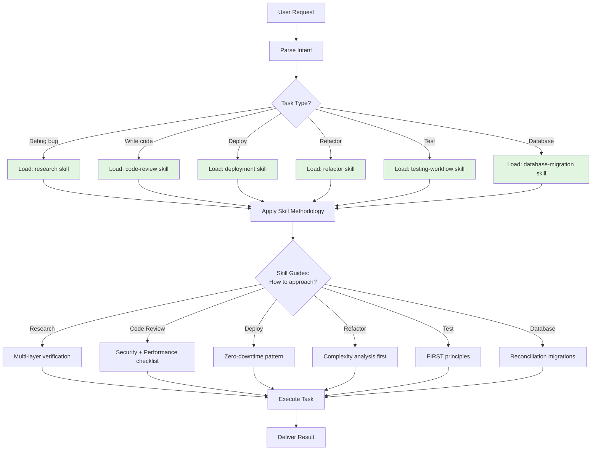
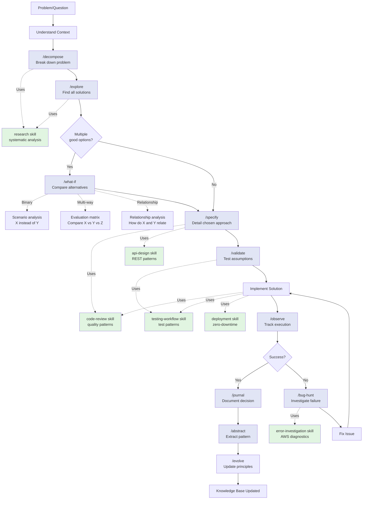
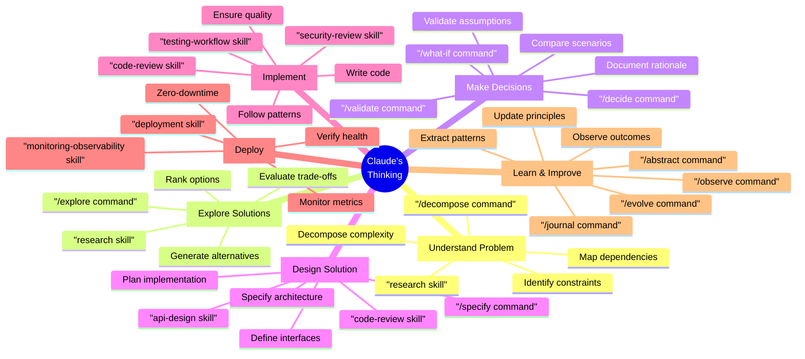

# Claude's Thinking Process Architecture

**How Skills and Commands Guide Claude's Cognition**

---

## 1. High-Level Architecture

```mermaid
graph TB
    subgraph "User Layer"
        U[User]
    end

    subgraph "Interface Layer"
        CMD["/commands<br/>(User-Invoked)"]
        CHAT[Natural Language]
    end

    subgraph "Claude's Cognitive Layer"
        CLAUDE[Claude Code Session]
        SKILLS[Skills<br/>(Auto-Discovered)]
        SYSPROMPT[System Prompt<br/>CLAUDE.md]
    end

    subgraph "Execution Layer"
        TOOLS[Tools<br/>(Read, Write, Bash, etc.)]
        MCP[MCP Servers<br/>(AWS, GitHub, etc.)]
    end

    subgraph "Storage Layer"
        FILES[".claude/ Files"]
        CODEBASE["Codebase<br/>(src/, docs/)"]
    end

    U -->|1. Invokes| CMD
    U -->|2. Asks| CHAT

    CMD -->|Orchestrates| CLAUDE
    CHAT -->|Processed by| CLAUDE

    CLAUDE -->|Reads guidance from| SKILLS
    CLAUDE -->|Follows principles from| SYSPROMPT

    SKILLS -.->|"Auto-discovered<br/>(when relevant)"| CLAUDE

    CLAUDE -->|Uses| TOOLS
    CLAUDE -->|Uses| MCP

    TOOLS -->|Read/Write| FILES
    TOOLS -->|Read/Write| CODEBASE
    MCP -->|Access| EXT[External Systems]

    style SKILLS fill:#e1f5e1
    style CMD fill:#e1e5f5
    style SYSPROMPT fill:#f5e1e1
    style CLAUDE fill:#fff4e1
```

**Key principles**:
- **Commands** = User-invoked workflows (explicit)
- **Skills** = Auto-discovered knowledge (implicit)
- **System Prompt** = Always-active principles (global)
- **Claude** = Orchestrator (applies all guidance)

---

## 2. Command Execution Flow


**Flow**:
1. User invokes command with arguments
2. Command loads workflow template
3. Claude auto-discovers relevant skills
4. Skills guide HOW to approach problem
5. Claude executes using tools
6. Output generated per command spec

---

## 3. Skill Auto-Discovery Flow



**Discovery logic**:
- Claude analyzes task intent
- Matches to skill domain (debugging → research, code → code-review)
- Loads skill methodology automatically
- Applies "how to" guidance from skill
- User never explicitly invokes skills (auto-discovered)

---

## 4. Thinking Process: Commands + Skills + Tools


**Pattern**: Commands orchestrate workflow, Skills guide methodology

---

## 5. Full Thinking Cycle (Decision Making)



**Full cycle**: Problem → Decompose → Explore → Specify → Validate → Implement → Observe → Document → Learn

### Metacognitive Commands (Thinking About Thinking)

Beyond problem-solving commands, Claude uses metacognitive tools to monitor and adjust its own thinking process.

#### `/reflect` - Analyze Actions and Reasoning

**Purpose**: Understand what happened and why you did what you did

**Output**: Pattern recognition, effectiveness assessment, behavioral insights

**When to use**:
- After completing a task (synthesize learnings)
- When stuck in a loop (detect patterns)
- Before escalating to different approach (meta-loop trigger)

**Relationship to Loops**:
- **Meta-loop trigger**: Reveals when current loop type isn't working
- **Pattern detection**: "I've tried 3 fixes with same error" → stuck signal
- **Effectiveness assessment**: Determines if current strategy making progress

**Example**:
```
/reflect
→ Pattern: Same /trace output 3 times (stuck in retrying loop)
→ Assessment: Execution varies but outcome identical
→ Meta-loop trigger: Escalate to initial-sensitive (question assumptions)
```

---

#### `/understand {concept}` - Build Mental Model

**Purpose**: Internal understanding (for Claude) + external explanation (for user)

**Prerequisite**: None (but often follows `/research`)

**Output**: Mental model, connections, explanations

**When to use**:
- Research skill (build understanding from investigation)
- Initial-sensitive loop (check if assumptions correct)
- Before explaining to user (ensure comprehension first)

**Relationship to Loops**:
- **Initial-sensitive**: Reveals faulty assumptions about system
- **Synchronize**: Aligns mental model with reality

**Generalization of**: `/explain` (which focuses on communication step only)

---

#### `/hypothesis {observation}` - Construct Explanations

**Purpose**: Ask "why" and construct plausible paths to explore

**Prerequisite**: Requires `/observe` output (need something to explain)

**Output**: Testable hypotheses, predictions, evidence needed

**When to use**:
- Before `/research` (generate what to investigate)
- Initial-sensitive loop (propose alternative assumptions)
- Root cause analysis (generate candidate causes)

**Relationship to Loops**:
- **Initial-sensitive**: Generates new assumptions to test
- **Retrying**: Proposes alternative root causes

**Workflow**: `/observe` → `/hypothesis` → `/research` → `/validate`

---

#### `/consolidate {topic}` - Synthesize Knowledge

**Purpose**: Gather → Understand → Consolidate → Communicate

**Superset of**: `/summary` (which only communicates final result)

**Output**: Unified coherent model, contradictions resolved, gaps identified

**When to use**:
- Synchronize loop (ensure knowledge coherence)
- Knowledge evolution (after learning from multiple sources)
- Before major decision (unify understanding)

**Relationship to Loops**:
- **Synchronize**: Ensures knowledge aligns with reality
- **Meta-loop**: Synthesizes learnings across loop iterations

**Steps**:
1. **Gather**: Collect information from sources
2. **Understand**: Build mental model
3. **Consolidate**: Resolve contradictions, fill gaps
4. **Communicate**: Present unified view

---

#### `/impact {change}` - Assess Change Scope

**Purpose**: Identify affected artifacts (direct + cascading effects)

**Output**: Ripple analysis (Level 1/2/3 effects), risk assessment

**When to use**:
- Branching loop (evaluate consequences of each path)
- Before major changes (understand blast radius)
- Architecture decisions (assess system-wide impact)

**Relationship to Loops**:
- **Branching**: Evaluates path consequences
- **Meta-loop**: Assesses impact of changing loop type

**Levels**:
- **Level 1**: Direct effects (files/modules explicitly changed)
- **Level 2**: Cascading effects (dependencies affected)
- **Level 3**: Indirect effects (assumptions, patterns, principles)

---

#### `/compare {A} vs {B}` - Structured Comparison

**Purpose**: Contrast alternatives across dimensions

**Output**: Trade-off analysis, decision criteria, recommendation

**When to use**:
- Branching loop (choose between paths)
- Choosing between approaches
- Evaluating trade-offs

**Relationship to Loops**:
- **Branching**: Evaluates multiple paths systematically
- **Meta-loop**: Compares loop types (which loop to use)

**Note**: `/compare` invokes `/what-if` with comparison mode. `/what-if` is broader (single scenario analysis), `/compare` is specialized (multi-alternative comparison).

---

#### `/trace {event} [forward|backward]` - Follow Causality

**Purpose**: Trace implications (forward) or root cause (backward)

**Output**: Causal chains (Event → Consequence OR Event ← Cause)

**When to use**:
- Retrying loop (find root cause of failure)
- Meta-loop (trace implications of decisions)
- Impact analysis (forward trace from change)

**Relationship to Loops**:
- **Retrying**: Backward trace to find root cause
- **Meta-loop**: Forward trace to understand implications

**Modes**:
- **Backward**: Event ← Cause ← Root (debugging)
- **Forward**: Event → Effect → Consequence (prediction)

---

### Tool Prerequisites (Workflow Ordering)

Natural ordering emerges from tool prerequisites (no hardcoded workflows):

```
/observe (notice phenomenon)
    ↓
/hypothesis (explain why) - REQUIRES: /observe output
    ↓
/research (test hypothesis) - REQUIRES: /hypothesis
    ↓
/validate (check claim) - REQUIRES: /research evidence
/proof (derive theorem) - REQUIRES: /research evidence
    ↓
/reflect (synthesize) - REQUIRES: completed work
    ↓
/consolidate (unify knowledge) - REQUIRES: /reflect insights
```

**Key principle**: Workflow emerges from tool design (self-documenting)

**Why prerequisites matter**:
- `/validate` and `/proof` require evidence → must follow `/research`
- `/hypothesis` requires observation → must follow `/observe`
- `/consolidate` requires insights → must follow `/reflect`
- `/reflect` requires completed work → comes after task completion

**Example workflow** (debugging):
```
/observe (notice failure)
    → /hypothesis (why might this fail?)
    → /research (test each hypothesis)
    → /validate (which hypothesis correct?)
    → /trace (find root cause)
    → /reflect (what pattern do I see?)
    → /consolidate (synthesize understanding)
```

---

## 6. Skill Types in Thinking Process


**Pattern**: Generalized (HOW to think) + Domain-specific (WHAT to apply) = Complete solution

---

## 7. Command Composition Pattern

```mermaid
graph LR
    subgraph "Meta-Cognitive Commands"
        MC1[/decompose]
        MC2[/abstract]
        MC3[/evolve]
        MC4[/explain]
    end

    subgraph "Exploration Commands"
        EX1[/explore]
        EX2[/what-if]
        EX3[/specify]
    end

    subgraph "Validation Commands"
        V1[/validate]
        V2[/proof]
    end

    subgraph "Documentation Commands"
        D1[/journal]
        D2[/observe]
    end

    subgraph "Workflow Commands"
        W1[/bug-hunt]
        W2[/refactor]
        W3[/review]
    end

    MC1 -->|"Feeds into"| EX1
    EX1 -->|"Feeds into"| EX2
    EX2 -->|"Feeds into"| EX3
    EX3 -->|"Feeds into"| V1
    V1 -->|"If valid"| IMPL[Implementation]
    IMPL -->|"Track"| D2
    D2 -->|"Document"| D1
    D1 -->|"Extract patterns"| MC2
    MC2 -->|"Update principles"| MC3

    W1 -.->|"Uses"| MC1
    W1 -.->|"Uses"| D2
    W1 -.->|"Uses"| D1

    W2 -.->|"Uses"| MC1
    W2 -.->|"Uses"| V1

    W3 -.->|"Uses"| V1

    style MC1 fill:#fff3cd
    style MC2 fill:#fff3cd
    style MC3 fill:#fff3cd
    style MC4 fill:#fff3cd

    style EX1 fill:#d1ecf1
    style EX2 fill:#d1ecf1
    style EX3 fill:#d1ecf1

    style V1 fill:#d4edda
    style V2 fill:#d4edda

    style D1 fill:#f8d7da
    style D2 fill:#f8d7da

    style W1 fill:#e2e3e5
    style W2 fill:#e2e3e5
    style W3 fill:#e2e3e5
```

**Composition**: Commands build on each other (decompose → explore → specify → validate → implement → observe → journal → abstract → evolve)

---

## 8. Information Flow Architecture


**Flow**: Knowledge sources → Claude's working memory → Execution → Knowledge outputs → Feedback loop

---

## 9. Thinking Layers (Abstraction Hierarchy)


**Hierarchy**:
- **Layer 1** (Principles): Rarely change, foundational
- **Layer 2** (Methodologies): Generalized thinking patterns
- **Layer 3** (Domain): Technology-specific knowledge
- **Layer 4** (Workflows): Orchestration and composition
- **Layer 5** (Execution): Active session state

**Feedback loops**: Execution results feed back to update higher layers

---

## 10. Cognitive Assistance Model



---

## Summary: How It All Works Together

### Commands (Blue boxes)
- **User-invoked** workflows
- **Orchestrate** the thinking process
- **Compose** with other commands
- **Example**: `/explore` → `/what-if` → `/specify` → `/validate`

### Skills (Green boxes)
- **Auto-discovered** by Claude
- **Guide** HOW to approach problems
- **Apply** methodology automatically
- **Example**: When debugging, `research` + `error-investigation` skills activate

### System Prompt (Red boxes)
- **Always active** principles
- **Constrain** all decisions
- **Foundational** rules
- **Example**: CLAUDE.md principles always enforced

### Tools (Gray boxes)
- **Execute** concrete actions
- **Access** files and systems
- **Produce** outputs
- **Example**: Read, Write, Bash, MCP tools

### The Full Cycle
```
User Problem
    ↓
Commands orchestrate workflow
    ↓
Skills guide methodology
    ↓
System Prompt constrains decisions
    ↓
Tools execute actions
    ↓
Outputs generated
    ↓
Feedback updates knowledge base
```

**Result**: Claude thinks systematically, consistently, and learns over time.
