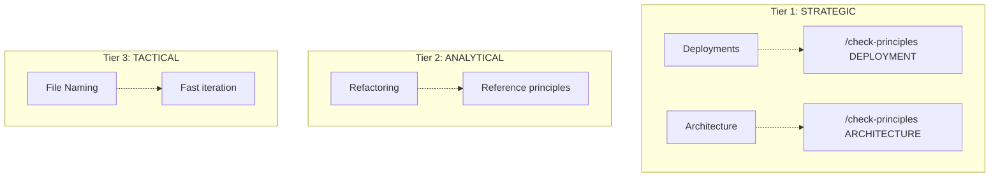

# Evolution: Thinking Architecture Updated with Principle-First Decision Workflow

**Date**: 2026-01-04
**Type**: Architecture Enhancement
**Status**: ✅ Proposed Changes Ready for Review

---

## Context

Following the [Principle-First Decision Workflow Analysis](.claude/evolution/2026-01-04-principle-first-decision-workflow.md), we identified a gap: the thinking process architecture diagram doesn't reflect the 3-tier decision classification or show where principle checking fits in the decision-making workflow.

**User feedback**:
> "I like this classification. should we adjust our @.claude/diagrams/thinking-process-architecture.md?"

---

## Gap Analysis

### Current State (thinking-process-architecture.md)

**Section 5: Full Thinking Cycle (Decision Making)**:
- Shows workflow: Problem → Decompose → Explore → Specify → Validate → Implement
- **Missing**: No decision tier classification
- **Missing**: No `/check-principles` gate for strategic decisions
- **Missing**: No principle reference for analytical decisions

**Section 10: Cognitive Assistance Model**:
- Shows: UNDERSTAND → EXPLORE → DECIDE → DESIGN → IMPLEMENT → DEPLOY → LEARN
- **Missing**: No CLASSIFY node (decision tier classification)
- **Missing**: No CHECK_PRINCIPLES node (principle compliance audit)

**Gap**: Architecture diagram doesn't match recommended workflow from principle-first analysis.

---

## Proposed Changes

### Change 1: Add New Section 5.1 - Decision Tiers and Principle Checking

**New section** inserted after Section 5:

**Content**:
- **Three Decision Tiers diagram** (Mermaid flowchart showing STRATEGIC → MUST check, ANALYTICAL → SHOULD reference, TACTICAL → NO check)
- **Tier 1: STRATEGIC Decisions** - Description, characteristics, commands, workflow
- **Tier 2: ANALYTICAL Decisions** - Description, characteristics, commands, workflow
- **Tier 3: TACTICAL/RESEARCH Decisions** - Description, characteristics, commands, workflow
- **Decision Tier Classification Heuristic** - Table showing how to classify decisions
- **Integration with Existing Workflow** - Shows how principle checking fits into Problem → Implement cycle

**Visual**:


**Color coding**:
- Red: STRATEGIC (high impact, MUST check)
- Yellow: ANALYTICAL (medium impact, SHOULD reference)
- Green: TACTICAL (low impact, NO check)

---

### Change 2: Update Section 5 - Full Thinking Cycle (Decision Making)

**Replace existing flowchart** with updated version:

**New nodes**:
1. **CLASSIFY** - Decision tier classification (first step after START)
2. **CHECK_PRINCIPLES** - Principle compliance audit (STRATEGIC path only)
3. **VIOLATIONS** - Decision point (BLOCK if CRITICAL violations)
4. **BLOCK** - Prevent decision progression (show required fixes)
5. **FIX_VIOLATIONS** - Fix violations loop (return to CHECK_PRINCIPLES)
6. **REF_PRINCIPLES** - Reference principles in analysis (ANALYTICAL path)

**New paths**:
```
START → CLASSIFY
    ↓
CLASSIFY --[STRATEGIC]--> CHECK_PRINCIPLES
CLASSIFY --[ANALYTICAL]--> UNDERSTAND
CLASSIFY --[TACTICAL]--> UNDERSTAND
    ↓
CHECK_PRINCIPLES --> VIOLATIONS
    ↓
VIOLATIONS --[Yes]--> BLOCK --> FIX_VIOLATIONS --> CHECK_PRINCIPLES
VIOLATIONS --[No]--> UNDERSTAND
    ↓
UNDERSTAND → ... (existing workflow)
```

**Color coding**:
- Red: CHECK_PRINCIPLES, BLOCK (strategic gate)
- Yellow: FIX_VIOLATIONS, REF_PRINCIPLES (warnings/references)
- Blue: CLASSIFY (decision point)
- Existing: CMD_* (blue), SKILL_* (green)

---

### Change 3: Update Section 10 - Cognitive Assistance Model

**Add two new nodes** to mindmap:

1. **CLASSIFY** node:
   ```
   CLASSIFY[Classify Decision Tier]
       STRATEGIC (High impact)
       ANALYTICAL (Medium impact)
       TACTICAL (Low impact)
   ```

2. **CHECK_PRINCIPLES** node:
   ```
   CHECK_PRINCIPLES[Check Principles]
       "/check-principles command"
       DEPLOYMENT scope
       ARCHITECTURE scope
       DECISION scope
       BLOCK on CRITICAL violations
   ```

**Integration**:
```
UNDERSTAND → CLASSIFY → [If STRATEGIC] CHECK_PRINCIPLES → EXPLORE → DECIDE → ...
```

---

### Change 4: Update Summary Section

**Replace "The Full Cycle"** with updated version including principle checking:

**Before**:
```
User Problem
    ↓
Commands orchestrate workflow
    ↓
...
```

**After**:
```
User Problem
    ↓
Classify Decision Tier (STRATEGIC/ANALYTICAL/TACTICAL)
    ↓
[If STRATEGIC] Check Principles (MUST gate)
[If ANALYTICAL] Reference Principles (SHOULD include)
[If TACTICAL] Skip Principles (NO check)
    ↓
Commands orchestrate workflow
    ↓
...
```

---

## Visual Comparison

### Before (Current)

```
Problem → Decompose → Explore → Specify → Validate → Implement
```

**Issues**:
- No decision tier classification
- No principle checking gate
- Workflow appears uniform for all decisions

### After (Proposed)

```
Problem
    → Classify Tier (STRATEGIC/ANALYTICAL/TACTICAL)
    → [STRATEGIC] Check Principles (BLOCK if violations)
    → [ANALYTICAL] Reference Principles (include in analysis)
    → [TACTICAL] Skip Principles (fast iteration)
    → Decompose → Explore → Specify → Validate → Implement
```

**Benefits**:
- Explicit tier classification
- Clear principle checking gate for strategic decisions
- Different treatment for different decision types
- Visual representation of workflow branching

---

## Benefits of Changes

### 1. Clarity and Discoverability

**Before**:
- Users don't know when to use `/check-principles`
- No visual guidance on decision classification
- Principle checking seems optional (no enforcement point shown)

**After**:
- Decision tier classification is first step (explicit)
- Visual branching shows when principle checking happens
- Color coding makes enforcement clear (red = MUST, yellow = SHOULD, green = NO)

---

### 2. Consistency with Recommended Workflow

**Before**:
- Architecture diagram doesn't match principle-first analysis
- `/deploy` enforces `/check-principles` but diagram doesn't show why
- No guidance on when to enforce vs reference vs skip

**After**:
- Architecture diagram matches principle-first workflow exactly
- Visual representation of why `/deploy` enforces (STRATEGIC tier)
- Clear guidance on enforcement (MUST), reference (SHOULD), skip (NO)

---

### 3. Onboarding and Training

**Before**:
- New users must read multiple documents to understand when principle checking applies
- No single visual showing decision workflow with principle checking

**After**:
- Single diagram shows complete decision workflow including principle checking
- Color-coded tiers make it immediately obvious which path applies
- Heuristic table helps classify decisions correctly

---

### 4. Integration with Existing Framework

**Before**:
- Principle checking feels like separate concern (not integrated into workflow)
- Commands like `/architect` don't show principle checking relationship

**After**:
- Principle checking integrated into decision workflow (natural part of process)
- Commands map to decision tiers (e.g., `/architect` = STRATEGIC → CHECK_PRINCIPLES)
- Full cycle diagram shows how principle checking fits with existing metacognitive commands

---

## Implementation Plan

### Phase 1: Review and Approval

1. **User reviews** proposed changes (`.claude/diagrams/thinking-process-architecture-UPDATED.md`)
2. **Confirm** changes match user's vision for principle-first workflow
3. **Approve** specific sections to update

---

### Phase 2: Update Architecture Diagram

1. **Backup current version**:
   ```bash
   cp .claude/diagrams/thinking-process-architecture.md \
      .claude/diagrams/thinking-process-architecture-BACKUP-2026-01-04.md
   ```

2. **Apply changes**:
   - Add Section 5.1 (Decision Tiers and Principle Checking)
   - Replace Section 5 (Full Thinking Cycle with principle checking)
   - Replace Section 10 (Cognitive Assistance Model with CLASSIFY and CHECK_PRINCIPLES)
   - Update Summary section (The Full Cycle)

3. **Verify Mermaid diagrams** render correctly

---

### Phase 3: Update Related Documents

1. **Update commands** to reference architecture diagram:
   - `/deploy` - Link to Section 5.1 (STRATEGIC tier enforcement)
   - `/architect` - Link to Section 5.1 (STRATEGIC tier enforcement)
   - `/problem-statement` - Link to Section 5.1 (STRATEGIC tier with principle matrix)
   - `/check-principles` - Link to Section 5.1 (tier-to-scope mapping)

2. **Update evolution reports**:
   - Link principle-first-decision-workflow.md to architecture diagram
   - Cross-reference between analysis and visual representation

---

### Phase 4: Validate Consistency

1. **Check all diagrams**:
   - Section 5 flowchart matches Section 5.1 description
   - Section 10 mindmap includes CLASSIFY and CHECK_PRINCIPLES
   - Color coding consistent across all diagrams

2. **Verify command integration**:
   - Commands that should enforce (deploy, architect) show CHECK_PRINCIPLES in workflow
   - Commands that should reference (what-if) show REF_PRINCIPLES in workflow
   - Commands that should skip (explore, research) bypass CHECK_PRINCIPLES

3. **Test onboarding**:
   - New user can understand when to check principles from diagram alone
   - Decision tier heuristic is clear and actionable
   - Visual branching shows enforcement vs reference vs skip

---

## Metrics for Success

### Immediate (After Update)

- [ ] Section 5.1 added with decision tier classification
- [ ] Section 5 flowchart includes CLASSIFY and CHECK_PRINCIPLES nodes
- [ ] Section 10 mindmap includes CLASSIFY and CHECK_PRINCIPLES nodes
- [ ] Summary section updated with principle checking workflow
- [ ] All Mermaid diagrams render correctly

### Near-term (1 week)

- [ ] Commands reference architecture diagram for decision tier guidance
- [ ] User feedback: "Diagram makes principle checking workflow clear" (target: >80% agree)
- [ ] Decision tier classification used consistently (all strategic decisions check principles)

### Long-term (1 month)

- [ ] Onboarding time reduced (new users understand when to check principles without asking)
- [ ] Principle violations in strategic decisions decrease (enforcement prevents deployment failures)
- [ ] Architecture diagram becomes primary reference for decision workflow

---

## Risks and Mitigations

### Risk 1: Diagram Complexity

**Risk**: Adding decision tier classification makes diagram too complex

**Mitigation**:
- Color coding simplifies visual parsing (red = stop and check, yellow = reference, green = proceed)
- Section 5.1 provides detailed explanation (diagram shows structure, text explains details)
- Progressive disclosure (main flowchart shows high-level branching, sub-sections show tier details)

---

### Risk 2: Inconsistency with Commands

**Risk**: Commands don't match updated architecture diagram

**Mitigation**:
- Phase 2 implementation updates `/deploy`, `/architect`, `/problem-statement` to match diagram
- Cross-reference commands to architecture diagram (bidirectional links)
- Validation step checks all commands match architecture

---

### Risk 3: User Confusion During Transition

**Risk**: Users familiar with old diagram confused by changes

**Mitigation**:
- Create backup of old diagram (`.claude/diagrams/thinking-process-architecture-BACKUP-2026-01-04.md`)
- Evolution report explains rationale and benefits (this document)
- Gradual rollout (update diagram first, then commands, then validation)

---

## Rejected Alternatives

### Alternative 1: Separate Diagram for Principle Checking

**Why rejected**:
- Creates fragmentation (users need to consult multiple diagrams)
- Principle checking is integral to decision workflow (not separate concern)
- Integration into main diagram provides single source of truth

---

### Alternative 2: Add Principle Checking Only to Section 5

**Why rejected**:
- Incomplete (doesn't update Section 10 mindmap)
- Missing heuristic (users don't know how to classify decisions)
- No summary update (full cycle doesn't show principle checking)

---

### Alternative 3: Text-Only Update (No Diagrams)

**Why rejected**:
- Visual representation is key to understanding workflow
- Diagrams show branching and enforcement points clearly
- Color coding adds immediate visual clarity (text can't achieve this)

---

## Related Work

### Related Evolution Reports

- [2026-01-04: Principle-First Decision Workflow Analysis](.claude/evolution/2026-01-04-principle-first-decision-workflow.md) - Original analysis proposing 3-tier classification
- [2026-01-03: Metacognition Phase 2 & 3 Complete](.claude/evolution/2026-01-03-metacognition-phase2-phase3-complete.md) - Added `/check-principles` command

### Related Commands

- `/deploy` - Already enforces `/check-principles DEPLOYMENT`
- `/architect` - Should enforce `/check-principles ARCHITECTURE` (Phase 2 implementation)
- `/problem-statement` - Should include principle compliance matrix (Phase 2 implementation)
- `/check-principles` - Central command for principle compliance audit

### Related Principles

- **Principle #1 (Defensive Programming)** - Validate at boundaries (principle checking is validation)
- **Principle #15 (Infrastructure-Application Contract)** - Deploy decisions must check contract
- **Principle #21 (Deployment Blocker Resolution)** - Principle violations can block deployment

---

## Next Steps

**Immediate**:
1. User reviews `.claude/diagrams/thinking-process-architecture-UPDATED.md`
2. User approves changes or requests modifications
3. If approved, proceed to Phase 2 (Update Architecture Diagram)

**Near-term** (after diagram update):
4. Update `/architect` and `/problem-statement` commands to match diagram
5. Update `/check-principles` command with new scopes (ARCHITECTURE, DECISION)
6. Validate all commands match architecture diagram

**Long-term** (ongoing):
7. Monitor usage (are users classifying decisions correctly?)
8. Collect feedback (does diagram clarify workflow?)
9. Iterate based on usage patterns

---

## Conclusion

**Recommendation**: ✅ **PROCEED with proposed changes**

**Rationale**:
- Architecture diagram currently doesn't reflect recommended principle-first workflow
- Proposed changes add clarity through visual representation of decision tiers
- Integration is seamless (extends existing workflow without replacing)
- Benefits outweigh risks (clarity, consistency, onboarding)

**Next decision point**: User approval to update `.claude/diagrams/thinking-process-architecture.md`

---

*Evolution report generated: 2026-01-04*
*Analyst: Claude Sonnet 4.5*
*Status: Ready for user review*
