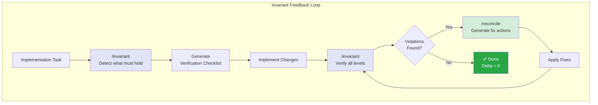

# Knowledge Evolution Report: Thinking Process Architecture

**Date**: 2026-01-13
**Focus area**: Thinking Process Architecture document drift
**Period reviewed**: Last 60 days

---

## Executive Summary

**Drift detected**: SIGNIFICANT (document 60+ days stale)
**New patterns**: 3 major thinking patterns undocumented
**New commands**: 8+ commands missing from diagrams
**Proposed updates**: HIGH priority

**Overall assessment**: Document needs substantial update to reflect current command inventory and newly established thinking patterns (especially Invariant Feedback Loop).

---

## Drift Analysis

### 1. Missing Commands (Not in Document)

| Command | Category | Purpose | Priority |
|---------|----------|---------|----------|
| `/invariant` | Verification | Identify behavioral invariants | HIGH |
| `/reconcile` | Verification | Converge violations to compliance | HIGH |
| `/x-ray` | Analysis | Deep structural inspection | MEDIUM |
| `/design` | Workflow | Domain-aware design | MEDIUM |
| `/transfer` | Meta-Cognitive | Abstract concepts between contexts | LOW |
| `/provision-env` | Workflow | Create isolated environments | LOW |
| `/adapt` | Meta-Cognitive | Adapt external patterns to codebase | LOW |
| `/problem-statement` | Decision | Recap decision context | MEDIUM |
| `/restructure` | Workflow | Code complexity analysis | LOW |
| `/locate` | Utility | Reverse-map task to files | LOW |

### 2. Missing Thinking Patterns

#### Pattern 1: Invariant Feedback Loop (HIGH PRIORITY)

**Not documented**: The document lacks the invariant verification loop which is now a core cognitive pattern.

```
CURRENT DOCUMENT:
Problem → Decompose → Explore → Specify → Validate → Implement → Observe

ACTUAL PRACTICE (new):
Problem → Classify → /invariant (detect) → Implement → /reconcile (converge) → /invariant (verify)
         ↓
         Invariant Feedback Loop: detect → converge → verify (delta = 0)
```

**Evidence**:
- `.claude/commands/invariant.md` (873 lines)
- `.claude/commands/reconcile.md` (new)
- `.claude/invariants/` (7 domain files)
- X-ray report: `.claude/reports/2026-01-13-xray-claude-knowledge-architecture.md`

**Recommendation**: Add Section 11.5 "Invariant Feedback Loop"

---

#### Pattern 2: Structural Inspection Pattern (MEDIUM PRIORITY)

**Not documented**: `/x-ray` enables deep inspection before design/implementation.

```
NEW PATTERN:
/x-ray (inspect structure) → /design (create solution) → /specify → /implement
```

**Evidence**:
- Git commit: `1112592 before creating /x-ray and /design`
- `.claude/commands/x-ray.md`
- `.claude/commands/design.md`

**Recommendation**: Add to Section 7 "Command Composition Pattern"

---

#### Pattern 3: Transfer/Adaptation Pattern (LOW PRIORITY)

**Not documented**: Framework for abstracting and adapting patterns across contexts.

```
NEW PATTERN:
/abstract (extract pattern) → /transfer (move between contexts) → /adapt (apply locally)
```

**Evidence**:
- Git commit: `ae4b669 feat(commands): Add Contextual Transfer Framework`
- `.claude/commands/transfer.md`
- `.claude/commands/adapt.md`

**Recommendation**: Document in Section 7 or create new Section 12

---

### 3. Outdated Diagrams

#### Section 7: Command Composition Pattern

**Current** (missing commands):
```
Meta-Cognitive: /decompose, /abstract, /evolve, /explain
Exploration: /explore, /what-if, /specify
Validation: /validate, /proof
Documentation: /journal, /observe
Workflow: /bug-hunt, /refactor, /review
```

**Proposed** (add categories):
```
Verification Commands:
    INV1[/invariant]
    INV2[/reconcile]

Inspection Commands:
    INSP1[/x-ray]
    INSP2[/locate]

Design Commands:
    DES1[/design]
    DES2[/problem-statement]
```

---

#### Section 5: Full Thinking Cycle

**Missing**: Invariant verification after implementation

**Current flow**:
```
IMPLEMENT → CMD_OBSERVE → WORKED? → ...
```

**Proposed addition**:
```
IMPLEMENT → CMD_INVARIANT["/invariant<br/>Verify invariants"] → VIOLATIONS?
    VIOLATIONS -->|Yes| CMD_RECONCILE["/reconcile<br/>Fix violations"]
    VIOLATIONS -->|No| CMD_OBSERVE
    CMD_RECONCILE --> CMD_INVARIANT
```

---

### 4. Knowledge Layer Update (Section 8)

**Missing output type**: `.claude/invariants/`

**Current Knowledge Outputs**:
```
O1[.claude/explorations/]
O2[.claude/journals/]
O3[.claude/observations/]
O4[.claude/validations/]
O5[Code changes]
```

**Proposed addition**:
```
O6[.claude/invariants/<br/>Behavioral contracts]
O7[.claude/reports/<br/>X-ray analyses]
O8[.claude/what-if/<br/>Scenario analyses]
```

---

## Proposed New Section: Invariant Feedback Loop

### Section 11.5: Invariant Verification Loop



**Loop Type**: Convergence Loop (not failure-driven like Retrying Loop)

**Tools**:
- `/invariant` - Identify invariants for goal
- `/reconcile` - Generate fix actions for violations

**5-Level Verification**:
| Level | Type | Example |
|-------|------|---------|
| 4 | Configuration | Env vars set |
| 3 | Infrastructure | Lambda → Aurora connectivity |
| 2 | Data | Aurora has correct data |
| 1 | Service | Lambda returns 200 |
| 0 | User | User can send /report |

**Relationship to Other Loops**:
- **Retrying Loop**: Fix execution after failure
- **Invariant Loop**: Verify constraints BEFORE claiming done

**Key Principle**: "Done" = All invariants verified (delta = 0)

---

## Specific Update Recommendations

### HIGH Priority (Update This Week)

1. **Add Section 11.5**: "Invariant Feedback Loop"
   - New diagram showing `/invariant` → `/reconcile` → `/invariant`
   - 5-level verification hierarchy
   - Relationship to claiming "done"

2. **Update Section 5 Diagram**: Add `/invariant` and `/reconcile` to Full Thinking Cycle
   - After IMPLEMENT node, add INVARIANT verification
   - Show loop back through RECONCILE on violations

3. **Update Section 7**: Add "Verification Commands" category
   - `/invariant`, `/reconcile`
   - Show composition: implementation → invariant → reconcile

### MEDIUM Priority (Update This Month)

4. **Update Section 3**: Add skill auto-discovery for invariant
   - When: deploying, schema change, API change
   - Loads: relevant invariant files from `.claude/invariants/`

5. **Update Section 8**: Add Knowledge Outputs
   - `.claude/invariants/` - Behavioral contracts
   - `.claude/reports/` - X-ray analyses
   - `.claude/what-if/` - Scenario analyses

6. **Add `/x-ray` and `/design`**: Structural inspection commands
   - Section 7: Add "Inspection Commands" category
   - Flow: `/x-ray` → `/design` → `/specify`

### LOW Priority (Backlog)

7. **Document Transfer Framework**: `/abstract` → `/transfer` → `/adapt`
   - New section or expand Section 7

8. **Add utility commands**: `/locate`, `/problem-statement`, `/restructure`
   - Categorize appropriately

---

## Tool-Loop Mapping Update

Add to Section 11 table:

| Loop Type | Primary Tools | Add |
|-----------|---------------|-----|
| **Invariant** | `/invariant`, `/reconcile` | **NEW** |

**Invariant Loop Properties**:
- **What changes**: Violations → compliance
- **When to use**: Before claiming "done", after deployment
- **Escalation signal**: Cannot converge delta to zero
- **Learning level**: Single-Loop (fix violations)

---

## Summary of Changes

| Section | Change | Priority |
|---------|--------|----------|
| NEW 11.5 | Add Invariant Feedback Loop | HIGH |
| Section 5 | Add `/invariant` to thinking cycle | HIGH |
| Section 7 | Add Verification Commands category | HIGH |
| Section 3 | Add invariant skill discovery | MEDIUM |
| Section 8 | Add new knowledge output types | MEDIUM |
| Section 7 | Add Inspection Commands | MEDIUM |
| Section 7 | Add Transfer Framework | LOW |

---

## Recommendation

**YES, update the Thinking Process Architecture document.**

The document is ~60 days stale and missing:
1. **Invariant Feedback Loop** - A core new cognitive pattern
2. **8+ new commands** - Not reflected in diagrams
3. **3 new thinking patterns** - Invariant, Inspection, Transfer

**Suggested approach**:
1. Add Section 11.5 for Invariant Feedback Loop (highest value)
2. Update Section 5 and 7 diagrams to include new commands
3. Consider the [what-if analysis from today](../what-if/2026-01-13-thinking-process-architecture-placement.md) about potential reorganization

---

## Next Evolution Review

**Recommended**: 2026-02-13

**Focus areas for next time**:
- Validate invariant loop adoption in practice
- Check if new commands are being used as documented
- Monitor for additional cognitive patterns emerging

---

*Report generated by `/evolve`*
*Generated: 2026-01-13*
