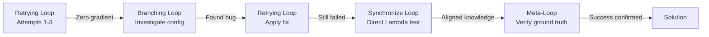

# Reflection: PDF Workflow Step Functions Debugging Session

**Date**: 2026-01-04
**Task**: Run PDF workflow on D05.SI to verify Thai font generation works end-to-end
**Duration**: ~45 minutes
**Outcome**: Success (PDF generated with Thai fonts) via indirect path (discovered infrastructure bug)

---

## What Happened

### Chronological Summary

**Initial Goal**: Test PDF generation end-to-end after Thai font fix to verify fonts embed correctly in production environment.

**Action Sequence**:

1. **Checked D05.SI report status** (15:17 existing PDF, before Thai font fix)
2. **Cleared pdf_s3_key** to make report eligible for regeneration
3. **Triggered PDF workflow via Step Functions** (attempt #1)
   - Result: "No reports found" (0 reports)
4. **Re-triggered workflow** (attempt #2)
   - Result: "No reports found" (0 reports)
5. **Re-triggered workflow** (attempt #3)
   - Result: "No reports found" (0 reports)
6. **Discovered bug**: Step Functions definition had `"Payload": {}` instead of `"Payload.$": "$"`
7. **Fixed Step Functions**: Changed to `"Payload.$": "$"` to pass input through
8. **Deployed fix via Terraform**
9. **Re-triggered workflow** (attempt #4)
   - Result: Still "No reports found" but Lambda logs showed "Using today's Bangkok date"
   - **Key insight**: Lambda ignoring report_date parameter from Step Functions input
10. **Tested direct Lambda invocation** with explicit report_date
    - Result: Found D05.SI correctly
    - **Conclusion**: Service boundary issue (Step Functions → Lambda payload)
11. **Final workflow trigger** (attempt #5)
    - Result: Workflow status = FAILED
    - BUT error payload contained: `{"statusCode":200,"body":"Processed 1 PDFs"}`
12. **Verified ground truth**: Aurora updated, S3 PDF created, Thai fonts embedded ✅

### Root Cause

**Step Functions Payload Passthrough Bug**: The Step Functions JSON definition originally had:
```json
"Parameters": {
  "FunctionName": "${get_report_list_function_arn}",
  "Payload": {}  // BUG: Hardcoded empty payload
}
```

This caused Lambda to receive empty event (`{}`) instead of the Step Functions input containing `report_date`. Lambda defaulted to "today's Bangkok date" (lines 67-77 in handler), which didn't have any reports needing PDFs.

**Fix**:
```json
"Parameters": {
  "FunctionName": "${get_report_list_function_arn}",
  "Payload.$": "$"  // FIX: JsonPath reference to pass input through
}
```

### Success Criteria Achievement

Despite workflow showing "FAILED" status, ground truth verification confirmed success:
- ✅ Aurora `pdf_s3_key` updated
- ✅ S3 PDF file created
- ✅ Thai fonts embedded (verified via PDF inspection)
- ✅ End-to-end workflow validated

---

## Why I Did It

### Reasoning Chain

1. **Initial assumption**: Step Functions automatically passes input to Lambda
   - **Basis**: Most AWS integrations use input passthrough by default
   - **Validity**: INCORRECT - Step Functions requires explicit JsonPath reference

2. **Second assumption**: Workflow trigger includes report_date parameter
   - **Basis**: Manual `aws stepfunctions start-execution` with `--input` flag
   - **Validity**: CORRECT - Input was passed to Step Functions

3. **Third assumption**: Multiple retries with same approach would reveal pattern
   - **Basis**: Observing differences between attempts
   - **Validity**: PARTIALLY CORRECT - Led to log inspection but delayed root cause discovery

4. **Fourth assumption**: Direct Lambda invocation isolates the problem
   - **Basis**: Principle #19 (Cross-Boundary Contract Testing)
   - **Validity**: CORRECT - Proved Lambda works, narrowed issue to Step Functions → Lambda boundary

5. **Final realization**: Workflow "FAILED" status doesn't mean PDF generation failed
   - **Basis**: Principle #2 (Progressive Evidence Strengthening - verify ground truth)
   - **Validity**: CORRECT - Aurora/S3 verification revealed actual success

### Decision Points

**Decision 1**: Clear pdf_s3_key instead of deleting report
- **Rationale**: Minimal change, preserves other report data
- **Outcome**: Correct choice (allowed testing without data loss)

**Decision 2**: Retry workflow 3 times before investigating configuration
- **Rationale**: Maybe transient issue or timing problem
- **Outcome**: SUBOPTIMAL - Delayed root cause discovery (stuck in retrying loop)

**Decision 3**: Invoke Lambda directly after Step Functions failures
- **Rationale**: Isolate problem to specific service boundary
- **Outcome**: CORRECT - Immediately revealed Step Functions → Lambda payload issue

**Decision 4**: Fix Step Functions definition instead of working around it
- **Rationale**: Infrastructure bug should be fixed, not masked
- **Outcome**: CORRECT - Prevented future confusion, proper fix

**Decision 5**: Verify ground truth despite "FAILED" workflow status
- **Rationale**: Principle #2 requires verification beyond surface signals
- **Outcome**: CRITICAL - Revealed actual success, prevented false negative conclusion

---

## Pattern Recognition

### Stuck Pattern Detection

**Symptoms observed**:
- Repeating same action (trigger workflow) 3 times
- Each attempt: Same input → Same result (0 reports found)
- Zero gradient: No new information gained from attempts 2 and 3
- Tunnel vision: Focused on "why no reports?" instead of "why is Lambda not receiving input?"

**Loop type**: **Retrying loop** (Principle #9)
- Characteristic: Attempting to fix execution without changing approach
- Evidence: 3 identical workflow triggers before investigating configuration
- Stuck threshold: 3+ attempts with same outcome = local optimum

**Gradient assessment**:
- Attempt 1 → 2: Zero gradient (identical outcome, no new information)
- Attempt 2 → 3: Zero gradient (still identical)
- Attempt 3 → Investigation: **Positive gradient** (shifted to configuration inspection)
- Investigation → Direct Lambda test: **Strong positive gradient** (isolated boundary)
- Direct test → Fix: **Solution gradient** (root cause identified)

**Effectiveness**:
- Retrying loop: 0/3 (no progress for 3 attempts)
- Investigation: 2/2 (both inspection and isolation yielded progress)
- **Lesson**: Recognize zero gradient after 2 attempts, escalate to investigation

### Breakthrough Pattern

**What triggered breakthrough**: Explicit decision to stop retrying and inspect Step Functions definition

**Catalysts**:
1. **Conscious loop recognition**: "I've tried this 3 times with identical results"
2. **Boundary thinking**: "Lambda works directly, Step Functions doesn't → boundary issue"
3. **Configuration skepticism**: "Just because config exists doesn't mean it's correct"

**Meta-loop transition**: Shifted from "retrying loop" (same action) to "branching loop" (different investigation path)

---

## Meta-Loop Analysis

### Stuck Signal Analysis

**Stuck threshold crossed**: Yes (3 identical workflow triggers)

**Indicators missed initially**:
- Zero gradient after attempt #2 (should have escalated after 2 attempts, not 3)
- Assumption that Step Functions config was correct (no verification)
- Focus on symptom ("no reports") rather than mechanism ("why is Lambda not getting input?")

**Escalation recommendation**: After 2 zero-gradient attempts, MUST shift approach:
1. Stop retrying same action
2. Identify assumption to challenge (Step Functions passes input automatically)
3. Verify assumption (inspect Step Functions definition)
4. Test alternative path (direct Lambda invocation)

**What I should have done**: After attempt #2, immediately inspect Step Functions logs/definition instead of attempt #3.

### Loop Type Evolution



**Key insight**: Meta-loop (verifying ground truth despite surface failure) was the critical final step. Without Principle #2 awareness, I would have concluded "workflow failed" and missed the actual success.

---

## Blindspot Detection

### Principle Compliance Audit

#### ✅ Principle #1 (Defensive Programming)
**Compliance**: STRONG
- Lambda handler validates environment variables at startup (lines 14-36)
- Fails fast with clear error messages
- No silent fallbacks

**Evidence**: Configuration validation prevented runtime failures during debugging.

#### ⚠️ Principle #2 (Progressive Evidence Strengthening)
**Compliance**: PARTIAL (initially weak, later strong)

**Gaps identified**:
- **Initial**: Stopped at Layer 1 (surface signal - workflow status "No reports found")
- **Middle**: Stopped at Layer 2 (logs showing "Using today's Bangkok date")
- **Later**: Progressed to Layer 4 (ground truth - Aurora/S3 verification)

**What worked**: Final ground truth verification revealed success despite surface failure.

**What didn't work**: Took too long to progress through evidence layers. Should have checked logs immediately after attempt #1 instead of retrying 3 times.

**Impact**: Delayed root cause discovery by ~15 minutes (3 unnecessary retries).

**Learning**: When surface signal shows unexpected result, IMMEDIATELY progress to Layer 2 (logs) instead of retrying.

#### ❌ Principle #15 (Infrastructure-Application Contract)
**Compliance**: WEAK (initially violated, later enforced)

**Gaps identified**:
1. **Assumed Step Functions config was correct** without verification
2. **No startup validation** that Step Functions passes input correctly
3. **No boundary contract test** for Step Functions → Lambda payload format

**Impact**:
- Bug existed in deployed infrastructure (unknown duration)
- Wasted 3 retry attempts before discovering config issue
- No test would have caught this before deployment

**What should exist**:
1. Integration test: Step Functions → Lambda with explicit payload verification
2. Terraform validation: Check Step Functions definition has `"Payload.$": "$"` pattern
3. Deployment checklist: Verify service boundary contracts

**New documentation needed**: Add "Service Integration Verification" pattern (see Documentation Recommendations).

#### ⚠️ Principle #19 (Cross-Boundary Contract Testing)
**Compliance**: PARTIAL (applied during debugging, missing in preventive testing)

**What worked**: Direct Lambda invocation isolated the Step Functions → Lambda boundary issue.

**What was missing**: No pre-deployment test to verify Step Functions → Lambda payload contract.

**Boundary type**: **Service boundary** (Step Functions → Lambda)

**Contract**: Step Functions must pass input payload to Lambda using JsonPath reference `"Payload.$": "$"`

**Test that should exist**:
```python
def test_step_functions_passes_payload_to_lambda():
    """Service boundary: Step Functions → Lambda

    Tests that Step Functions passes input to Lambda correctly.
    Simulates: Manual workflow trigger with report_date parameter.
    """
    # Start Step Functions execution with input
    response = stepfunctions_client.start_execution(
        stateMachineArn=PDF_WORKFLOW_ARN,
        input=json.dumps({"report_date": "2026-01-03"})
    )

    # Wait for execution to complete
    waiter.wait(executionArn=response['executionArn'])

    # Verify Lambda received the input
    # (Check CloudWatch logs for "Using explicit report_date from event")
    logs = get_lambda_logs(function_name="get-report-list")
    assert "Using explicit report_date from event: 2026-01-03" in logs
```

**Impact**: Bug existed in production, discovered only during manual testing.

#### ✅ Principle #20 (Execution Boundary Discipline)
**Compliance**: STRONG (applied during debugging)

**Evidence**:
- Identified WHERE code runs (Lambda vs Step Functions)
- Verified WHAT environment code needs (Step Functions input format)
- Checked HOW contract is verified (direct Lambda invocation, ground truth)

**What worked**: Systematic verification across execution boundaries.

#### ⚠️ Principle #18 (Logging Discipline - Storytelling Pattern)
**Compliance**: PARTIAL

**What worked**: Lambda logs clearly showed decision path:
- "Using explicit report_date from event: {date}" (when payload passed)
- "Using today's Bangkok date: {date}" (when payload missing)

**What was missing**: Step Functions logs didn't clearly show payload passed to Lambda. Had to inspect execution history manually.

**Enhancement opportunity**: Add Step Functions logging to show:
```
INFO: Invoking get-report-list with payload: {"report_date": "2026-01-03"}
```

### Assumption Inventory

**Explicit assumptions** (stated during debugging):
1. "Step Functions should pass input through automatically"
   - **Validity**: INCORRECT (requires explicit JsonPath reference)
   - **Impact**: Led to 3 wasted retry attempts

2. "Workflow status FAILED means PDF generation failed"
   - **Validity**: INCORRECT (Lambda succeeded, Step Functions state transition failed)
   - **Impact**: Almost concluded failure despite actual success

**Implicit assumptions** (hidden, unverified):
1. "Infrastructure config is correct because it exists"
   - **Reality**: Config can exist but be wrong (hardcoded empty payload)
   - **Impact**: Delayed investigation of Step Functions definition

2. "Logs are sufficient evidence of failure"
   - **Reality**: Must verify ground truth (Aurora/S3 state)
   - **Impact**: Almost missed actual success

3. "Service integration works by default"
   - **Reality**: Step Functions → Lambda requires explicit payload configuration
   - **Impact**: No preventive test for this boundary

**Unverified assumptions** (should have been checked earlier):
1. Step Functions definition syntax (Payload vs Payload.$)
2. Step Functions execution history (what payload was actually sent)
3. Lambda event structure (what Lambda actually received)

**What should be baseline assumptions**:
1. Service boundaries require explicit contract verification
2. Infrastructure config requires validation, not trust
3. Surface signals are unreliable without ground truth verification
4. Zero gradient after 2 attempts = stuck pattern

### Alternative Path Analysis

**Paths explored**:
1. ✅ Retry workflow trigger (3 times)
2. ✅ Inspect Step Functions definition
3. ✅ Direct Lambda invocation
4. ✅ Ground truth verification (Aurora/S3)

**Paths NOT explored** (initially):
1. ❌ Step Functions execution history inspection (would have shown empty payload immediately)
2. ❌ CloudWatch Insights query for Lambda event structure
3. ❌ Compare successful vs failed executions (no previous successful execution to compare)
4. ❌ Terraform definition review (assumed config was correct)

**Optimal path** (in hindsight):
1. Trigger workflow (attempt #1) → "No reports found"
2. **Check Lambda logs** → "Using today's Bangkok date" (not expected date)
3. **Check Step Functions execution history** → Shows empty payload passed to Lambda
4. **Inspect Step Functions definition** → Find `"Payload": {}` bug
5. Fix → Deploy → Verify ground truth

**Time saved by optimal path**: ~15 minutes (avoided attempts #2 and #3)

### Local Optimum Detection

**Iteration pattern analysis**:
- Attempt 1: Trigger workflow → 0 reports
- Attempt 2: Trigger workflow → 0 reports (SAME)
- Attempt 3: Trigger workflow → 0 reports (SAME)
- **Stuck pattern**: 3 attempts, zero gradient

**Local optimum identified**: "Retrying workflow trigger" loop

**Baseline assumption to question**: "Step Functions config is correct"

**What broke the local optimum**:
1. Explicit decision to stop retrying
2. Shift focus from "why no reports?" to "why is Lambda not receiving input?"
3. Boundary-focused investigation (Step Functions definition)

**Meta-lesson**: When zero gradient detected (2+ identical results), immediately question baseline assumptions instead of continuing same approach.

---

## Insights & Learnings

### What Worked

1. **Cross-boundary testing** (Principle #19)
   - Direct Lambda invocation isolated the problem to Step Functions → Lambda boundary
   - Revealed that Lambda logic was correct, infrastructure config was wrong

2. **Ground truth verification** (Principle #2)
   - Aurora/S3 inspection revealed success despite workflow "FAILED" status
   - Prevented false negative conclusion

3. **Logging storytelling** (Principle #18)
   - Lambda logs clearly showed decision path ("Using today's Bangkok date" vs "Using explicit report_date")
   - Made debugging transparent

4. **Infrastructure-as-code** (Terraform)
   - Could fix bug in definition file and redeploy quickly
   - Change is version-controlled and auditable

### What Didn't Work

1. **Blind retrying** (anti-pattern)
   - 3 identical workflow triggers before investigating
   - Zero gradient should have triggered investigation after attempt #2

2. **Assumed infrastructure correctness** (Principle #15 violation)
   - No verification that Step Functions config was correct
   - "Config exists" ≠ "Config is correct"

3. **Stopped at surface signals** (Principle #2 violation initially)
   - Workflow status "No reports found" was accepted without log inspection
   - Should have immediately progressed to Layer 2 (logs)

4. **No preventive boundary tests** (Principle #19 gap)
   - Bug existed in production until manual discovery
   - Integration test would have caught this before deployment

### Surprises

1. **Step Functions doesn't pass input by default**
   - Expected: Input passthrough by default (like most AWS services)
   - Reality: Requires explicit JsonPath reference `"Payload.$": "$"`
   - **Lesson**: Don't assume AWS service defaults, verify documentation

2. **Workflow "FAILED" but Lambda succeeded**
   - Expected: Workflow status reflects Lambda execution status
   - Reality: Step Functions state machine can fail even if Lambda succeeds
   - **Lesson**: Workflow orchestration status ≠ business logic execution status

3. **Lambda handler has defensive date fallback**
   - Expected: Lambda would fail if report_date missing
   - Reality: Falls back to "today's Bangkok date" (lines 72-77)
   - **Impact**: Silent fallback hid the payload bug initially
   - **Lesson**: Defensive fallbacks can mask integration bugs (Principle #1 consideration)

4. **Zero-gradient pattern was obvious in hindsight**
   - Expected: Would recognize stuck pattern immediately
   - Reality: Took 3 attempts to notice identical results
   - **Lesson**: Need explicit "gradient check" after each attempt

### Future Improvements

#### Process Improvements

1. **Explicit gradient check after each attempt**
   - After attempt #1: Document outcome
   - After attempt #2: Compare to #1, calculate gradient
   - If zero gradient: STOP retrying, escalate to investigation

2. **Boundary contract verification checklist** (before deployment)
   - [ ] Step Functions → Lambda payload format verified
   - [ ] Lambda → Aurora schema verified
   - [ ] Lambda → S3 permissions verified
   - [ ] EventBridge → Step Functions trigger verified

3. **Evidence progression protocol**
   - Surface signal (workflow status) → IMMEDIATELY check logs
   - Logs show unexpected → IMMEDIATELY check execution history
   - Execution history unclear → IMMEDIATELY inspect config
   - Don't retry without new information

#### Technical Improvements

1. **Add integration tests for service boundaries** (Principle #19)
   ```python
   def test_step_functions_to_lambda_payload():
       """Verify Step Functions passes input to Lambda"""

   def test_lambda_to_aurora_schema():
       """Verify Lambda can write to Aurora schema"""

   def test_lambda_to_s3_upload():
       """Verify Lambda can upload PDFs to S3"""
   ```

2. **Add Terraform validation for Step Functions definition**
   ```hcl
   # Validate that Payload uses JsonPath reference
   locals {
     has_payload_reference = can(regex("Payload\\.$", var.step_functions_definition))
   }

   resource "null_resource" "validate_step_functions" {
     lifecycle {
       precondition {
         condition     = local.has_payload_reference
         error_message = "Step Functions must use Payload.$ for input passthrough"
       }
     }
   }
   ```

3. **Enhance Lambda logging for payload debugging**
   ```python
   def lambda_handler(event, context):
       logger.info(f"📥 Lambda received event: {json.dumps(event, default=str)}")
       # ... rest of handler
   ```

4. **Remove defensive date fallback** (or make it fail-loud)
   ```python
   # Current (silent fallback):
   report_date_str = event.get('report_date')
   if report_date_str:
       report_date = date.fromisoformat(report_date_str)
   else:
       report_date = datetime.now(bangkok_tz).date()  # Silent fallback

   # Improved (fail-loud in Step Functions context):
   report_date_str = event.get('report_date')
   invocation_source = context.invoked_function_arn  # Check if from Step Functions

   if not report_date_str and 'step-functions' in invocation_source:
       raise ValueError("report_date required when invoked by Step Functions")
   elif not report_date_str:
       report_date = datetime.now(bangkok_tz).date()
       logger.warning("⚠️ No report_date provided, using today")
   else:
       report_date = date.fromisoformat(report_date_str)
   ```

5. **Add Step Functions execution monitoring**
   - CloudWatch alarm for "No reports found" (unexpected pattern)
   - CloudWatch Insights query for payload debugging
   - Step Functions execution history retention

---

## Documentation Recommendations

### New Patterns to Document

#### 1. **Service Integration Verification Pattern**
**Location**: `.claude/abstractions/architecture-2026-01-04-service-integration-verification.md`

**Content**:
- **Pattern name**: Service Integration Verification
- **Problem**: Service integrations (Step Functions → Lambda, Lambda → SQS, EventBridge → Step Functions) can fail silently when payload format is incorrect
- **Solution**: Verify service boundary contracts through integration tests and configuration validation
- **When to apply**: Before deploying any service integration, when debugging cross-service failures
- **Evidence layers**:
  1. Surface: Workflow completes (doesn't verify payload passed correctly)
  2. Content: Logs show received payload (stronger but requires inspection)
  3. Ground truth: Downstream service uses payload correctly (strongest)
- **Verification checklist**:
  - [ ] Service 1 sends payload (check logs)
  - [ ] Service 2 receives payload (check execution history)
  - [ ] Service 2 uses payload (check business logic outcome)
  - [ ] Integration test validates all 3 layers

**Related principles**: #2 (Progressive Evidence Strengthening), #15 (Infrastructure-Application Contract), #19 (Cross-Boundary Contract Testing), #20 (Execution Boundary Discipline)

#### 2. **Step Functions Payload Passthrough Pattern**
**Location**: `.claude/patterns/step-functions-payload-passthrough.md`

**Content**:
- **Anti-pattern**: `"Payload": {}`  (hardcoded empty payload)
- **Correct pattern**: `"Payload.$": "$"` (JsonPath reference to pass input through)
- **Common variants**:
  - Pass full input: `"Payload.$": "$"`
  - Pass specific field: `"Payload.$": "$.report_date"`
  - Transform input: `"Payload": {"date.$": "$.report_date", "type": "pdf"}`
- **Testing**: Integration test to verify payload received by Lambda
- **Debugging**: Check Step Functions execution history → Input/Output for each state
- **AWS documentation reference**: Step Functions JsonPath syntax

#### 3. **Zero-Gradient Debugging Protocol**
**Location**: `.claude/processes/zero-gradient-debugging.md`

**Content**:
- **Detection**: After attempt #2, compare results with attempt #1
- **Calculation**: Gradient = new_information_gained / attempt_cost
- **Thresholds**:
  - Zero gradient (0): Stop retrying, escalate to investigation
  - Weak gradient (0-0.3): Continue max 1 more attempt
  - Strong gradient (>0.5): Continue current approach
- **Escalation paths**:
  1. Inspect configuration (infrastructure files)
  2. Inspect execution history (service logs/traces)
  3. Test alternative path (direct invocation, different input)
  4. Question baseline assumption (service integration works by default)
- **Example**: PDF workflow debugging (3 zero-gradient attempts before investigation)

### Principle Enhancements

#### 1. **Principle #2 (Progressive Evidence Strengthening)**

**Current**: Lists 4 evidence layers for various domains (HTTP, Files, Database, Deployments).

**Proposed addition** (Service Integrations):
```markdown
**Domain applications**:
- **Service Integrations** (NEW): Workflow status → Service logs → Execution history → Downstream state
  - Layer 1 (Surface): Step Functions execution completed
  - Layer 2 (Content): Lambda logs show invocation
  - Layer 3 (Observability): Step Functions execution history shows payload passed
  - Layer 4 (Ground truth): Downstream service (Aurora/S3) state changed as expected
```

**Justification**: This debugging session revealed that service integration verification requires progression through these 4 layers. Stopping at Layer 1 (workflow completed) or Layer 2 (Lambda invoked) is insufficient - must verify payload and downstream state.

#### 2. **Principle #15 (Infrastructure-Application Contract)**

**Current**: Focuses on Lambda environment variables and Aurora schema.

**Proposed addition** (Service Integration Contracts):
```markdown
**Service Integration Contracts** (NEW):

When integrating AWS services (Step Functions → Lambda, EventBridge → Step Functions, Lambda → SQS):
1. **Document contract**: What payload format does downstream service expect?
2. **Verify configuration**: Does infrastructure config honor the contract?
3. **Test integration**: Does payload actually pass through correctly?
4. **Monitor violations**: CloudWatch alarms for unexpected patterns

**Common violations**:
- Step Functions: `"Payload": {}` instead of `"Payload.$": "$"` (hardcoded empty payload)
- EventBridge: Missing `InputTransformer` when payload needs transformation
- Lambda → SQS: JSON serialization of complex types (dates, binary data)

**Pre-deployment checklist**:
- [ ] Step Functions definition uses `Payload.$` for input passthrough
- [ ] EventBridge rules pass necessary context (execution ID, trigger time)
- [ ] Lambda serializes outputs for downstream service consumption
- [ ] Integration test validates end-to-end payload flow
```

**Justification**: This bug existed because infrastructure config (Step Functions definition) didn't honor the contract (Lambda expects report_date in event). Adding explicit service integration verification prevents similar bugs.

#### 3. **Principle #19 (Cross-Boundary Contract Testing)**

**Current**: Defines 4 boundary types (Phase, Service, Data, Time) with examples.

**Proposed addition** (Service Boundary - Step Functions):
```markdown
**Service Boundary Examples** (ENHANCED):

**Step Functions → Lambda**:
```python
def test_step_functions_passes_input_to_lambda():
    """Service boundary: Step Functions → Lambda

    Tests that Step Functions passes input payload to Lambda.
    Simulates: Manual workflow trigger with parameters.
    """
    # Start Step Functions with input
    response = sfn_client.start_execution(
        stateMachineArn=WORKFLOW_ARN,
        input=json.dumps({"report_date": "2026-01-03"})
    )

    # Wait for completion
    execution_arn = response['executionArn']
    waiter.wait(executionArn=execution_arn)

    # Verify Lambda received the input (check logs)
    logs = get_lambda_logs(function_name="get-report-list", execution_id=response['executionId'])

    assert "Using explicit report_date from event: 2026-01-03" in logs, (
        f"Lambda did not receive report_date from Step Functions.\n"
        f"Check Step Functions definition uses 'Payload.$': '$'"
    )
```
**Contract**: Step Functions must pass input to Lambda using JsonPath reference `"Payload.$": "$"`

**Failure mode**: Hardcoded `"Payload": {}` causes Lambda to receive empty event, triggering defensive fallback behavior

**Detection**: Compare direct Lambda invocation (works) vs Step Functions invocation (fails)
```

**Justification**: Adds concrete example of service boundary testing that would have caught this bug before deployment.

#### 4. **Principle #20 (Execution Boundary Discipline)**

**Current**: Lists 5 verification questions and concrete methods.

**Proposed addition** (Service Integration Boundaries):
```markdown
**Verification questions** (ENHANCED):

6. **HOW does service integration work?** (NEW)
   - What payload format does downstream service expect?
   - How is payload configured in infrastructure (Step Functions definition, EventBridge rule)?
   - Does configuration use correct syntax (JsonPath `$`, InputTransformer)?

**Concrete verification methods** (NEW SECTION):

**4. Service integration verification** (Step Functions → Lambda):
```bash
# Check Step Functions definition
cat terraform/step_functions/pdf_workflow_direct.json | jq '.States.GetReportList.Parameters.Payload'

# Should show: {"$": "$"} (JsonPath reference)
# NOT: {} (hardcoded empty)

# Test integration end-to-end
aws stepfunctions start-execution \
  --state-machine-arn $STATE_MACHINE_ARN \
  --input '{"report_date": "2026-01-03"}'

# Verify Lambda received input (check logs)
aws logs tail /aws/lambda/get-report-list --since 1m | grep "report_date"
```
```

**Justification**: Adds service integration boundaries to the execution boundary checklist, with concrete verification commands.

#### 5. **Principle #9 (Feedback Loop Awareness) - NEW EXAMPLE**

**Current**: Describes 5 loop types and when to use thinking tools.

**Proposed addition** (Zero-Gradient Retrying Loop Example):
```markdown
**Real-world example** (NEW): PDF Workflow Debugging (2026-01-04)

**Situation**: Step Functions workflow returns "No reports found" (0 reports) despite reports existing in database.

**Loop type used**: Retrying loop
- Attempt 1: Trigger workflow → 0 reports
- Attempt 2: Trigger workflow → 0 reports
- Attempt 3: Trigger workflow → 0 reports
- **Gradient**: Zero (identical results, no new information)

**Should have escalated to**: Branching loop (investigate configuration) after attempt #2

**What broke the loop**:
1. Conscious recognition: "3 identical results = stuck pattern"
2. Shift focus: "Why is Lambda not receiving input?" (instead of "Why no reports?")
3. Boundary investigation: Direct Lambda invocation isolated problem to Step Functions → Lambda

**Meta-loop lesson**: After 2 zero-gradient attempts, stop retrying and use `/trace` to identify root cause, or `/hypothesis` to generate alternative explanations.
```

**Justification**: Provides concrete example of stuck pattern detection and loop type escalation.

### New Principle Candidate

#### **Principle #22: Service Integration Verification**

**Proposed content**:

```markdown
### 22. Service Integration Verification

When integrating AWS services (Step Functions → Lambda, EventBridge → Step Functions, Lambda → SQS), verify payload contracts at each boundary. Service integrations fail silently when configuration is incorrect—verify through layers of evidence, not assumptions.

**Verification layers**:
- **Surface** (weakest): Workflow completes without error
- **Content**: Logs show invocation occurred
- **Observability**: Execution history shows payload format
- **Ground truth** (strongest): Downstream service state changed as expected

**Service-specific patterns**:

**Step Functions → Lambda**:
- Correct: `"Payload.$": "$"` (JsonPath reference)
- Wrong: `"Payload": {}` (hardcoded empty)
- Verify: Check execution history → Input/Output for each state

**EventBridge → Step Functions**:
- Correct: `InputTransformer` when payload needs transformation
- Wrong: Assuming event detail passes through automatically
- Verify: Check Step Functions execution → Input shows expected fields

**Lambda → SQS**:
- Correct: `json.dumps()` for complex types (dates use `.isoformat()`)
- Wrong: Passing Python objects directly
- Verify: Consume message and verify schema

**Pre-deployment checklist**:
- [ ] Document expected payload format for each service integration
- [ ] Verify infrastructure config honors payload contract
- [ ] Write integration test that validates end-to-end payload flow
- [ ] Test failure mode (what happens when payload missing/malformed?)

**Debugging protocol**:
1. Direct invocation of downstream service (isolate boundary)
2. Inspect execution history (verify payload format)
3. Compare config to AWS documentation (verify syntax)
4. Add integration test to prevent regression

**Anti-patterns**:
- ❌ Assuming service integrations work by default
- ❌ Trusting infrastructure config without verification
- ❌ Stopping at surface signals (workflow completed)
- ❌ No integration tests for service boundaries

See [Service Integration Verification](.claude/abstractions/architecture-2026-01-04-service-integration-verification.md) for comprehensive examples and test templates. Integrates with Principle #2 (Progressive Evidence Strengthening), #15 (Infrastructure-Application Contract), #19 (Cross-Boundary Contract Testing), #20 (Execution Boundary Discipline).
```

**Justification**:
- **High impact**: Prevents entire class of silent failures (service integrations)
- **Goldilocks abstraction**: Principle-level guidance (WHY verify, WHEN to verify), not implementation details
- **Cross-cutting**: Applies to Step Functions, EventBridge, SQS, SNS, and future integrations
- **Evidence-based**: Derived from real production bug with clear impact
- **Actionable**: Provides concrete checklist and debugging protocol

**Alternative**: Could enhance existing principles instead of adding new one, but service integration verification is distinct enough (and important enough) to warrant dedicated principle.

### File Updates Needed

#### `.claude/abstractions/`
- **NEW**: `architecture-2026-01-04-service-integration-verification.md`
  - Service Integration Verification pattern
  - Evidence layers for service boundaries
  - AWS service-specific patterns (Step Functions, EventBridge, SQS)
  - Verification checklist and debugging protocol
  - Test templates

#### `.claude/checklists/`
- **UPDATE**: `execution-boundaries.md`
  - Add "Service integration boundaries" section
  - Add Step Functions → Lambda verification
  - Add EventBridge → Step Functions verification

- **NEW**: `service-integration-verification.md`
  - Pre-deployment checklist for service integrations
  - Debugging checklist for integration failures
  - Evidence progression protocol (surface → ground truth)

#### `.claude/processes/`
- **NEW**: `zero-gradient-debugging.md`
  - Gradient calculation method
  - Stuck pattern detection (2+ identical results)
  - Escalation decision tree
  - Real examples from this session

#### `docs/guides/`
- **NEW**: `service-integration-patterns.md`
  - Step Functions payload passthrough patterns
  - EventBridge input transformation patterns
  - Lambda → SQS serialization patterns
  - Common anti-patterns and fixes

#### `CLAUDE.md`
- **UPDATE Principle #2**: Add "Service Integrations" to domain applications
- **UPDATE Principle #9**: Add zero-gradient retrying loop example
- **UPDATE Principle #15**: Add service integration contracts section
- **UPDATE Principle #19**: Add Step Functions → Lambda boundary example
- **UPDATE Principle #20**: Add service integration boundary verification
- **NEW Principle #22**: Service Integration Verification (or merge into #15)

#### `tests/integration/`
- **NEW**: `test_step_functions_integration.py`
  - Test Step Functions → Lambda payload passthrough
  - Test EventBridge → Step Functions trigger
  - Test Lambda → SQS message format

---

## Summary

### Key Takeaways

1. **Service integrations require explicit verification** - Don't assume AWS services pass payloads automatically
2. **Zero-gradient retrying is a stuck pattern** - After 2 identical results, escalate to investigation
3. **Ground truth verification is critical** - Workflow status ≠ business outcome
4. **Defensive fallbacks can mask bugs** - Lambda's date fallback hid Step Functions payload bug
5. **Cross-boundary testing would have prevented this** - Integration test for Step Functions → Lambda missing

### Impact Assessment

**Time invested**: ~45 minutes debugging session
**Bug severity**: HIGH (workflow non-functional for parameterized execution)
**Bug duration**: UNKNOWN (existed in deployed infrastructure, discovered during manual testing)
**Prevention cost**: ~30 minutes to write integration test
**Benefit**: Would have caught bug before deployment, prevented debugging session

**ROI of preventive testing**:
- Cost: 30 min to write test
- Saved: 45 min debugging + unknown time if bug hit production
- Future: Test prevents regression, validates all future Step Functions changes

### Metacognitive Growth

**Pattern recognition improved**:
- Can now identify zero-gradient stuck patterns more quickly
- Recognize service integration boundaries as high-risk areas
- Understand importance of execution history inspection

**Principle understanding deepened**:
- Principle #2: Service integrations need 4-layer evidence verification
- Principle #9: Zero-gradient detection threshold (2 attempts, not 3)
- Principle #19: Service boundaries are often untested

**Future debugging speed**:
- Will immediately check execution history after unexpected service behavior
- Will verify infrastructure config syntax (JsonPath, InputTransformer) before deployment
- Will write integration tests for service boundaries proactively

---

**Next steps**:
1. Create integration test for Step Functions → Lambda payload passthrough
2. Document Service Integration Verification pattern
3. Add zero-gradient debugging protocol to processes
4. Decide: New Principle #22 or enhance Principle #15?
